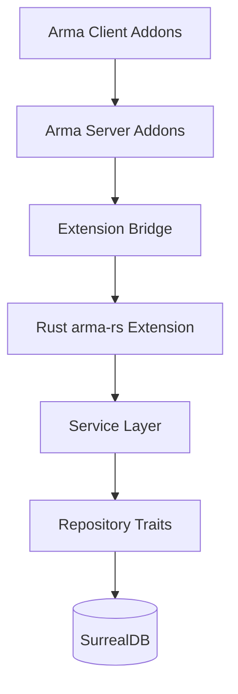
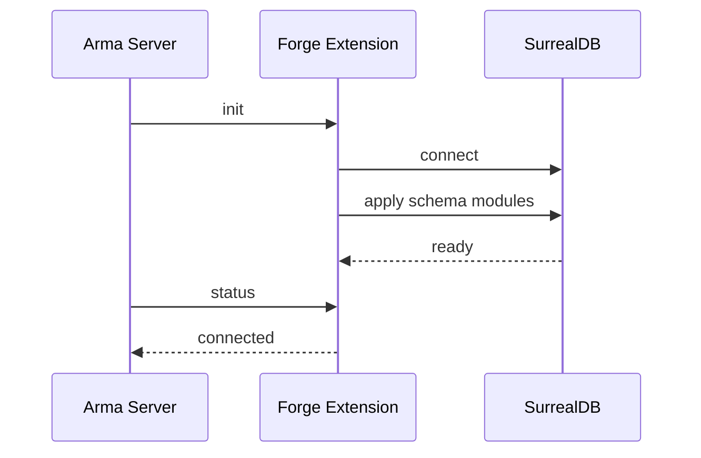
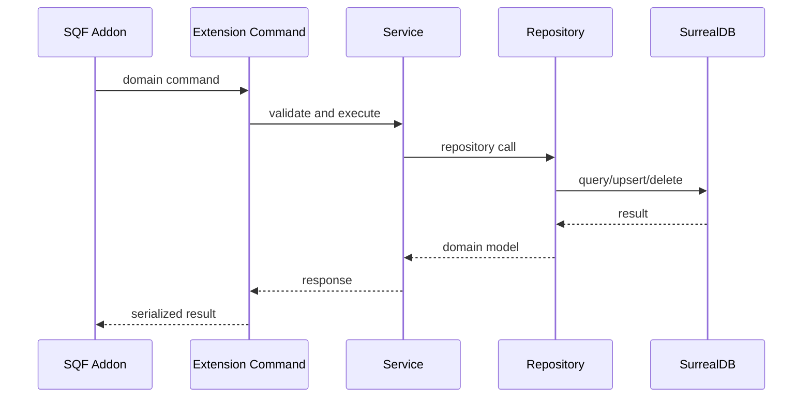

# Forge Architecture

## Runtime Flow

```mermaid
flowchart TD
    Client[Arma Client Addons] --> Server[Arma Server Addons]
    Server --> Bridge[Extension Bridge]
    Bridge --> Extension[Rust arma-rs Extension]
    Extension --> Services[Service Layer]
    Services --> Repositories[Repository Traits]
    Repositories --> Surreal[(SurrealDB)]
```

## Persistence Startup

```mermaid
sequenceDiagram
    participant Arma as Arma Server
    participant Ext as Forge Extension
    participant Db as SurrealDB

    Arma->>Ext: init
    Ext->>Db: connect
    Ext->>Db: apply schema modules
    Db-->>Ext: ready
    Arma->>Ext: status
    Ext-->>Arma: connected
```

## Data Access

```mermaid
sequenceDiagram
    participant SQF as SQF Addon
    participant Ext as Extension Command
    participant Service as Service
    participant Repo as Repository
    participant Db as SurrealDB

    SQF->>Ext: domain command
    Ext->>Service: validate and execute
    Service->>Repo: repository call
    Repo->>Db: query/upsert/delete
    Db-->>Repo: result
    Repo-->>Service: domain model
    Service-->>Ext: response
    Ext-->>SQF: serialized result
```
