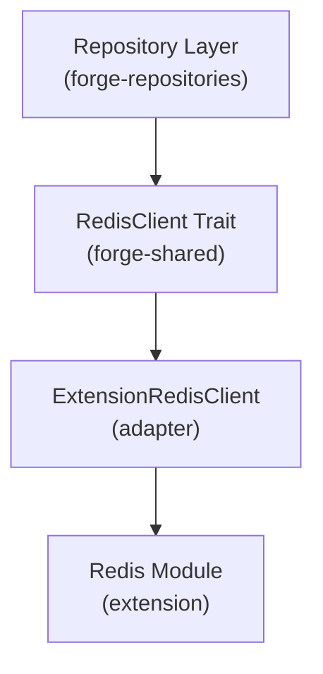

# Adapters Module

This module provides adapter implementations that bridge the repository layer with the extension's Redis operations. Adapters translate between the generic `RedisClient` trait and the extension-specific Redis module.

## Architecture

The adapters module follows the **Adapter Pattern**, allowing the repository layer to remain decoupled from the specific Redis implementation:



This design enables:

- **Testability**: Repositories can use mock adapters for testing
- **Flexibility**: Different Redis implementations can be swapped without changing repositories
- **Separation of Concerns**: Repository logic is independent of Redis connection details

## ExtensionRedisClient

The `ExtensionRedisClient` is the primary adapter that implements the `RedisClient` trait from `forge_shared`.

### Responsibilities

- **Translate Calls**: Convert trait method calls to Redis module function calls
- **Error Handling**: Parse Redis operation results and convert to `Result` types
- **Data Transformation**: Handle response parsing (e.g., JSON arrays for lists/sets)
- **Logging**: Log debug information for Redis operations

### Implemented Operations

#### Hash Operations

| Method         | Description                    | Returns                  |
| -------------- | ------------------------------ | ------------------------ |
| `hash_mset`    | Set multiple fields atomically | `Result<(), String>`     |
| `hash_get_all` | Get all fields and values      | `Result<String, String>` |
| `hash_get`     | Get a single field value       | `Result<String, String>` |
| `hash_del`     | Delete a field                 | `Result<(), String>`     |

#### List Operations

| Method       | Description           | Returns                       |
| ------------ | --------------------- | ----------------------------- |
| `list_rpush` | Append to list        | `Result<(), String>`          |
| `list_range` | Get range of elements | `Result<Vec<String>, String>` |
| `list_del`   | Remove by value       | `Result<(), String>`          |

#### Set Operations

| Method        | Description     | Returns                       |
| ------------- | --------------- | ----------------------------- |
| `set_add`     | Add member      | `Result<(), String>`          |
| `set_members` | Get all members | `Result<Vec<String>, String>` |
| `set_del`     | Remove member   | `Result<(), String>`          |

#### Common Operations

| Method       | Description         | Returns                |
| ------------ | ------------------- | ---------------------- |
| `key_exists` | Check if key exists | `Result<bool, String>` |
| `delete_key` | Delete key          | `Result<(), String>`   |

### Usage Example

```rust
use crate::adapters::ExtensionRedisClient;
use forge_shared::RedisClient;

// Create the adapter
let client = ExtensionRedisClient::new();

// Use it with the RedisClient trait
let fields = vec![
    ("name".to_string(), "John".to_string()),
    ("age".to_string(), "30".to_string()),
];
client.hash_mset("user:123".to_string(), fields)?;

// Retrieve data
let data = client.hash_get_all("user:123".to_string())?;
```

## Error Handling

The adapter translates Redis string responses to Rust `Result` types:

- **Success**: Returns `Ok(value)` with the appropriate type
- **Error**: Returns `Err(message)` if the response starts with "Error:"

```rust
// Redis module returns "OK" → Adapter returns Ok(())
// Redis module returns "Error: Connection failed" → Adapter returns Err("Error: Connection failed")
```

### Response Parsing

For operations that return collections, the adapter parses JSON responses:

```rust
// list_range returns JSON: ["item1", "item2", "item3"]
let items = client.list_range("mylist".to_string(), 0, -1)?;
// items: Vec<String> = vec!["item1", "item2", "item3"]
```

## Contributing

We welcome contributions to the adapters module! Follow these guidelines to add new adapter methods or create new adapters.

### Adding a New Method to ExtensionRedisClient

To add a new method (e.g., `hash_exists`), follow these steps:

1.  **Check the Trait**: Ensure the method is defined in the `RedisClient` trait in `forge_shared`.

    ```rust
    // In forge_shared/src/redis_client.rs
    pub trait RedisClient: Send + Sync {
        fn hash_exists(&self, key: String, field: String) -> Result<bool, String>;
    }
    ```

2.  **Implement the Method**: Add the implementation to `ExtensionRedisClient`.

    ```rust
    impl RedisClient for ExtensionRedisClient {
        fn hash_exists(&self, key: String, field: String) -> Result<bool, String> {
            // Call the Redis module function
            let result = redis::hash::hash_exists(key, field);

            // Parse the response
            match result.as_str() {
                "1" => Ok(true),
                "0" => Ok(false),
                _ if result.starts_with("Error:") => Err(result),
                _ => Err(format!("Unexpected response: {}", result)),
            }
        }
    }
    ```

3.  **Add Logging** (if needed): For debugging, log the operation.

    ```rust
    fn hash_exists(&self, key: String, field: String) -> Result<bool, String> {
        let result = redis::hash::hash_exists(key, field);
        log("debug", "DEBUG", &format!("hash_exists({}, {}): {}", key, field, result));

        match result.as_str() {
            "1" => Ok(true),
            "0" => Ok(false),
            _ if result.starts_with("Error:") => Err(result),
            _ => Err(format!("Unexpected response: {}", result)),
        }
    }
    ```

4.  **Handle Response Types**: Match the return type to the trait signature.
    - **Unit type** (`()`): Return `Ok(())` on success
    - **Boolean**: Parse "1"/"0" to `true`/`false`
    - **String**: Return the value directly
    - **Vec**: Parse JSON array response
    - **Number**: Parse string to number

### Creating a New Adapter

To create a new adapter (e.g., `MockRedisClient` for testing):

1.  **Create the Module File**: Add `src/adapters/mock_client.rs`.
2.  **Define the Struct**: Create the adapter struct.

    ```rust
    use forge_shared::RedisClient;
    use std::collections::HashMap;
    use std::sync::RwLock;

    /// Mock Redis client for testing.
    ///
    /// Uses RwLock to allow multiple concurrent readers while maintaining thread safety.
    pub struct MockRedisClient {
        data: RwLock<HashMap<String, String>>,
    }

    impl MockRedisClient {
        pub fn new() -> Self {
            Self {
                data: RwLock::new(HashMap::new()),
            }
        }
    }
    ```

3.  **Implement the Trait**: Implement all `RedisClient` methods.

    ```rust
    impl RedisClient for MockRedisClient {
        fn hash_mset(&self, key: String, fields: Vec<(String, String)>) -> Result<(), String> {
            // Acquire write lock only when modifying data
            let mut data = self.data.write().unwrap();
            for (field, value) in fields {
                let hash_key = format!("{}:{}", key, field);
                data.insert(hash_key, value);
            }
            Ok(())
        }

        fn hash_get(&self, key: String, field: String) -> Result<String, String> {
            // Acquire read lock - multiple threads can read concurrently
            let data = self.data.read().unwrap();
            let hash_key = format!("{}:{}", key, field);
            Ok(data.get(&hash_key)
                .map(|v| v.clone())
                .unwrap_or_default())
        }

        // ... implement other methods
    }
    ```

4.  **Register the Module**: Add to `src/adapters/mod.rs`.

    ```rust
    pub mod redis_client;
    pub mod mock_client;

    pub use redis_client::ExtensionRedisClient;
    pub use mock_client::MockRedisClient;
    ```

### Concurrency Best Practices

> [!IMPORTANT]
> Choose the right synchronization primitive based on your access patterns and performance requirements.

**Recommended Synchronization Primitives:**

| Primitive             | Use Case                                 | Performance             | Dependency       |
| --------------------- | ---------------------------------------- | ----------------------- | ---------------- |
| **`RwLock<HashMap>`** | Read-heavy workloads, concurrent readers | Good (multiple readers) | Standard library |
| **`Mutex<HashMap>`**  | Write-heavy or exclusive access required | Fair (single lock)      | Standard library |
| **`DashMap`**         | Extreme high-frequency reads/writes      | Excellent (lock-free)   | External crate   |

**When to use each:**

- **`RwLock`**: Best for most use cases. Allows multiple concurrent readers, only blocks on writes. Use this by default.
- **`Mutex`**: Only when you need exclusive access or operations are very lightweight (< 1μs).
- **`DashMap`**: When profiling shows `RwLock` is a bottleneck and you need lock-free performance.

**Why avoid `Mutex` for read-heavy workloads?**

- Blocks all threads (readers and writers) on every access
- No concurrent reads possible
- Can cause performance bottlenecks in high-concurrency scenarios

### Best Practices

- **Error Consistency**: Always check for "Error:" prefix in Redis responses
- **Type Safety**: Ensure return types match the trait signature exactly
- **Logging**: Log operations at DEBUG level for troubleshooting
- **Response Parsing**: Handle all possible response formats (success, error, unexpected)
- **Documentation**: Document the purpose and behavior of each method
- **Testing**: Test adapters with both success and error scenarios
