# Mission Designer Guide

Build playable Forge missions in Eden with the required interaction objects,
garage markers, and CAD-compatible task modules.

This guide focuses on editor placement and mission validation. Framework
internals, extension commands, and persistence details are covered in the
developer-oriented module guides.

## Core Rule

Most Forge systems become available to players through nearby Eden objects.
Place the object, give it the correct variable name in Eden, and the server
initializer marks it with the runtime variable the actor menu scans for.

Players must be within 5 meters of the object for the actor menu to offer the
action.

## Interaction Objects

Use the object's Eden variable name, not its display name. The matching is
case-sensitive in some initializers, so use lower-case names.

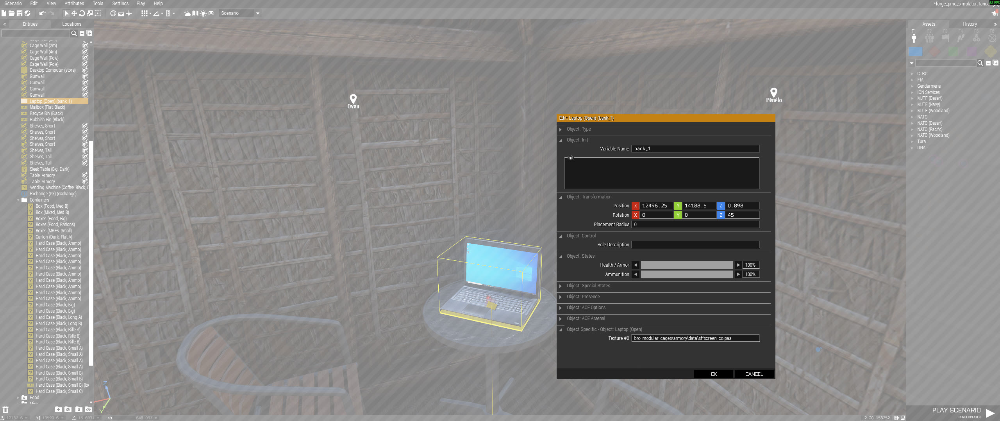

| System | Eden Object Variable Name | Runtime Variable | Player Action | Notes |
| --- | --- | --- | --- | --- |
| Bank | name contains `bank` | `isBank = true` | Full bank UI | Allows full banking workflows, including PIN changes. |
| ATM | name contains `atm` | `isAtm = true` | ATM bank UI | ATM mode requires PIN authorization and does not allow PIN changes. |
| Store | name contains `store` | `isStore = true` | Store UI | Store catalog and checkout behavior are configured server-side. |
| Garage | name contains `garage` | `isGarage = true` | Garage UI and virtual garage | Include a garage category in the name or set `garageType` manually. |
| Locker | name contains `locker` | local `isLocker = true` | Virtual arsenal action | The server hides the editor object; each client creates a local locker at the same position. |
| Transport | `transport`, `transport_1` through `transport_10` | discovered by variable name or `isTransport = true` | Transport destination menu | Paid player and cargo transfer between named transport nodes. |

Recommended object names:

```text
atm
bank
store
locker
transport
transport_1
garage_hq
garage_hq_2
```

The example mission uses short lower-case names. Keep single-use objects simple,
add an index when there may be multiple copies, and include a site label for
garage objects so related spawn markers can share the same prefix.

Avoid using `forge_locker_box` as an editor-placed locker variable name. That
name is reserved by the client-side virtual arsenal box.

## Manual Object Variables

The automatic initializers are the normal path. If a mission script creates
interaction objects dynamically, set the same variables manually:

```sqf
_bankLaptop setVariable ["isBank", true, true];
_atmTerminal setVariable ["isAtm", true, true];
_storeCounter setVariable ["isStore", true, true];
_garageTerminal setVariable ["isGarage", true, true];
_garageTerminal setVariable ["garageType", "cars", true];
_transportNode setVariable ["isTransport", true, true];
```

Supported garage types are:

- `cars`
- `armor`
- `helis`
- `planes`
- `naval`
- `other`

## Garage Markers

Garage interaction objects open the garage UI. Vehicle spawn positions come
from Eden markers.

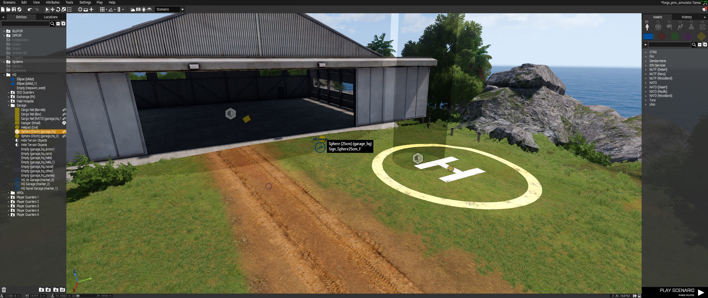

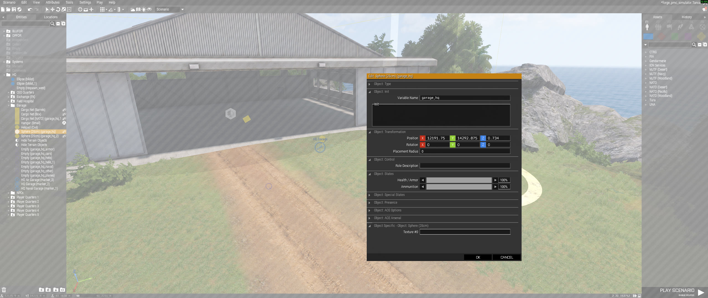

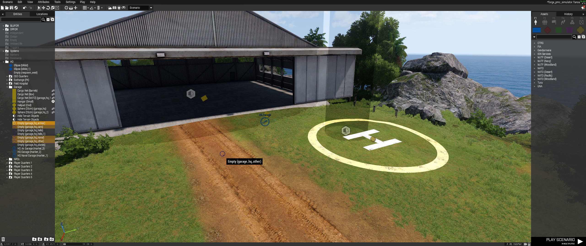

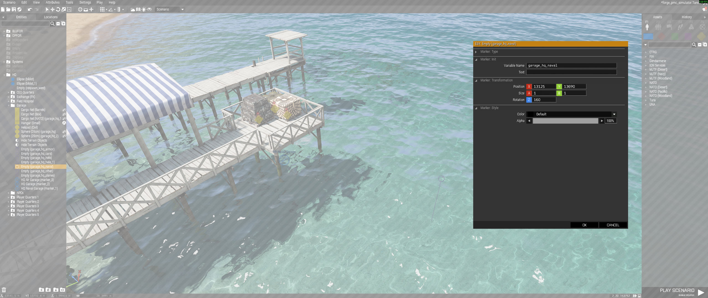

Additional garage sites use the same pattern: place another garage interaction
object, give it a `garage` variable name that identifies the site, then place
matching category spawn markers near that garage.

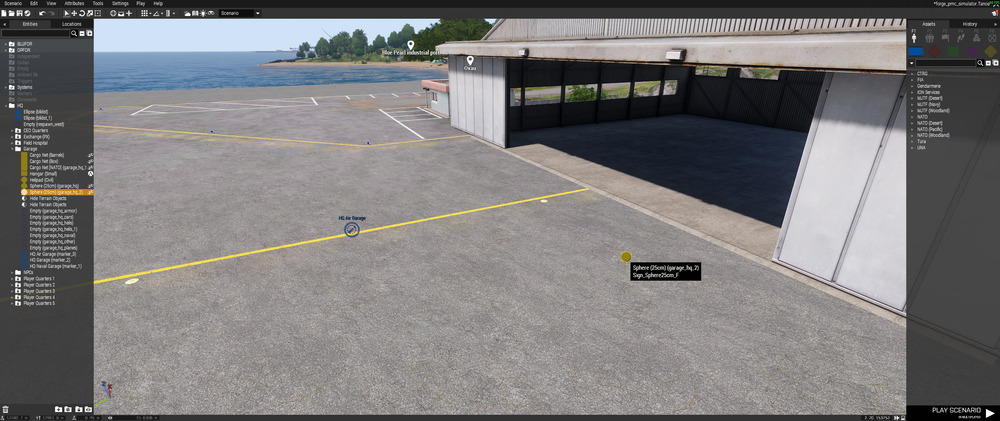

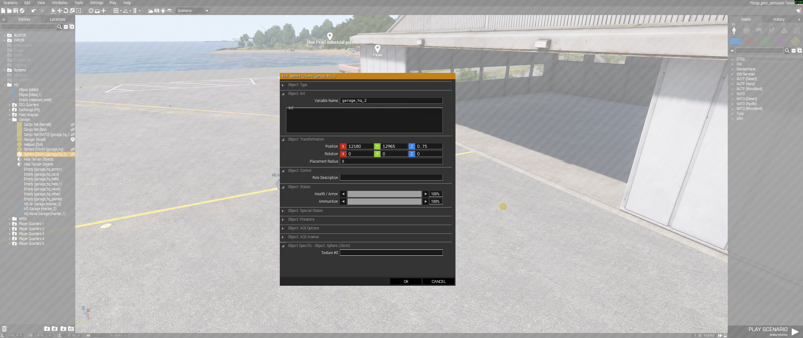

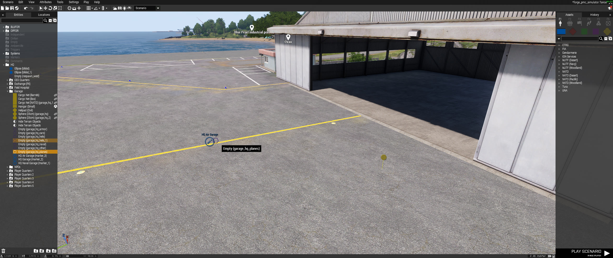

Create empty markers near each garage site. Marker names must contain `garage`
and one supported garage category:

```text
garage_hq_cars
garage_hq_armor
garage_hq_helis
garage_hq_helis_1
garage_hq_planes
garage_hq_naval
garage_hq_other
```

This convention keeps the site and category visible in the marker name:
`garage_hq_planes` is the planes spawn marker for `garage_hq`, while
`garage_hq_2` can use another nearby set of `garage_hq_*` category markers for
the second HQ garage area. If two garage objects of the same category are close
to each other, include the full object name in the marker prefix, such as
`garage_hq_2_planes`.

Use these rules:

1. Put the marker where the vehicle should spawn.
2. Rotate the marker to control spawn heading.
3. Keep the marker close to the matching garage object.
4. Include the garage object's variable name when multiple garages exist at
   different sites.
5. Do not allow parked vehicles to block the marker. If a vehicle is within 5
   meters of the spawn position, the virtual garage blocks the session.

Vehicle spawning is strict by category. A garage without a matching category
marker cannot spawn that vehicle category.

## Store Setup

Store objects only unlock the store UI. The actual item catalog, prices,
payment source handling, locker grants, and garage unlocks are server-owned.

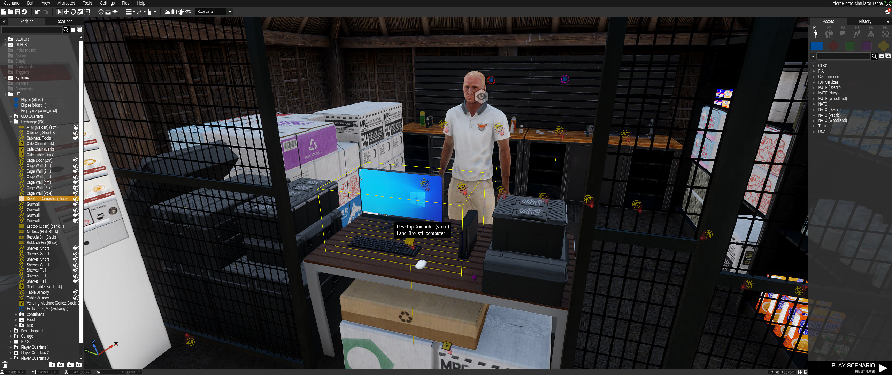

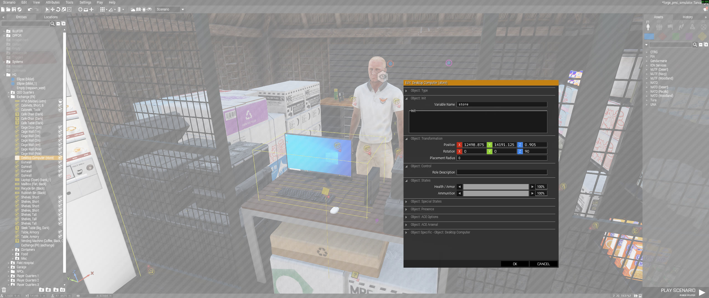

Minimum Eden setup:

1. Place a terminal, table, NPC, or other object players can stand near.
2. Set its Eden variable name to something containing `store`.
3. Test that the actor menu shows the store action within 5 meters.

## Transport Setup

Transport nodes are generic paid travel points. They can represent ferries,
airports, bus stops, teleport terminals, or any other mission transport system.
The framework owns the menu, billing, cargo scan, and movement logic. The
mission only needs placed objects and arrival markers.

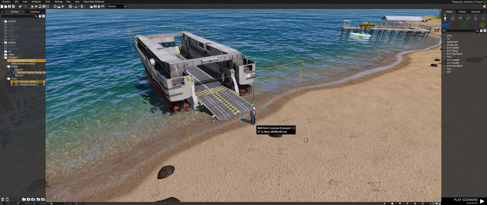

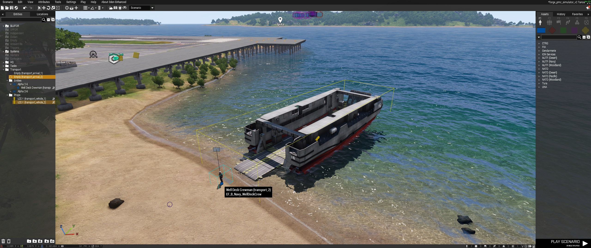

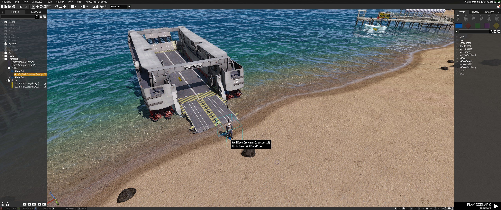

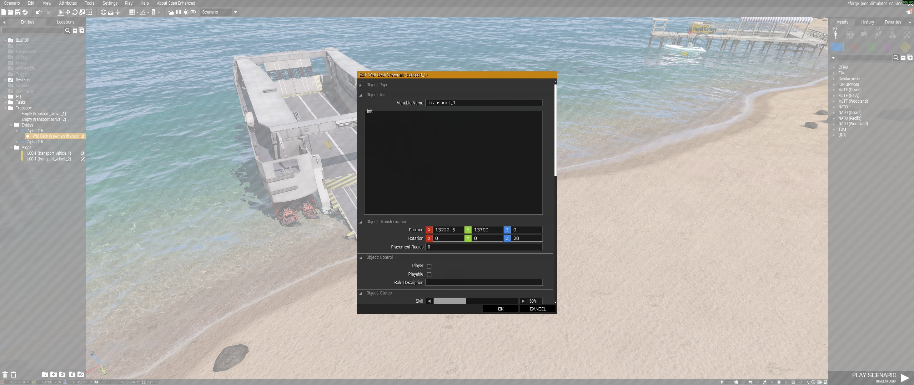

Place transport node objects with these variable names:

```text
transport
transport_1
transport_2
...
transport_10
```

Place arrival markers with matching suffixes:

```text
transport_arrival
transport_arrival_1
transport_arrival_2
...
transport_arrival_10
```

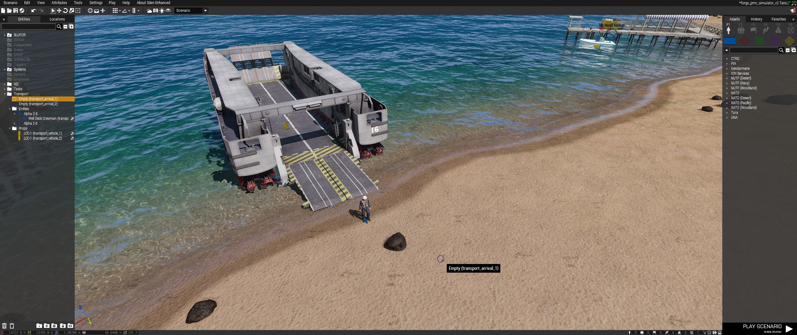

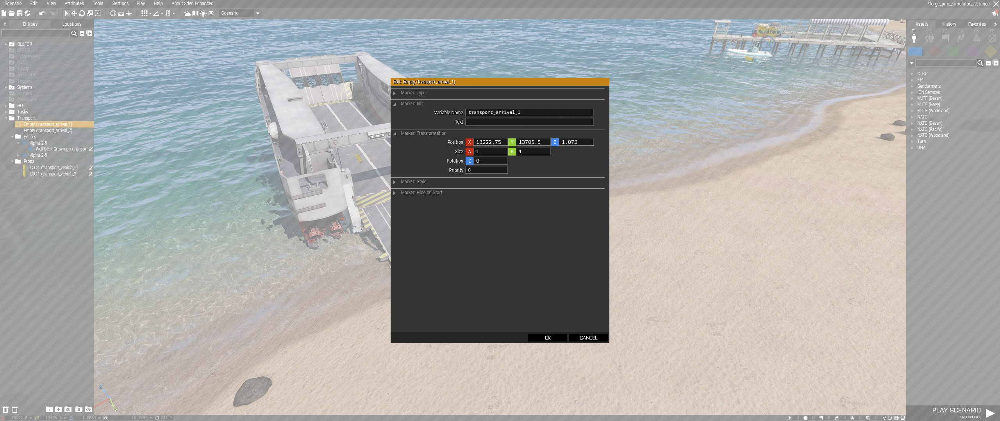

Objects that should be excluded from the nearby cargo scan, such as the actual
boat or transport vehicle used as set dressing, should use:

```text
transport_vehicle
transport_vehicle_1
transport_vehicle_2
...
transport_vehicle_10
```

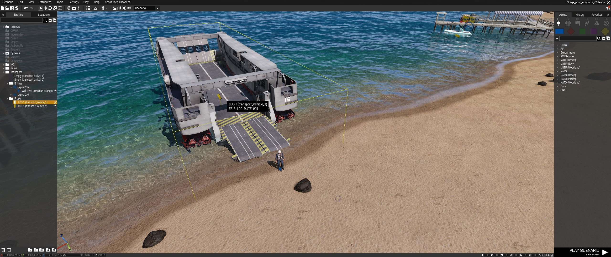

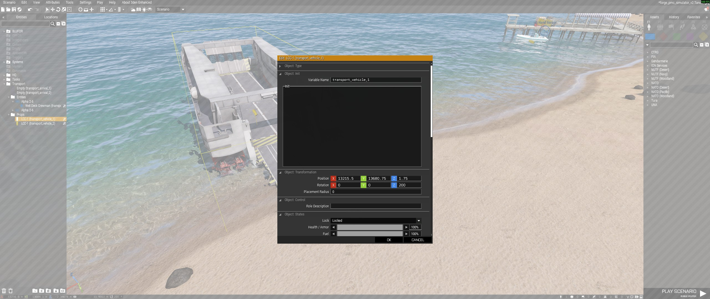

Minimum Eden setup:

1. Place at least two transport node objects.
2. Name them `transport`, `transport_1`, and so on.
3. Place matching `transport_arrival*` markers where players and cargo should
   appear.
4. Name any set-dressing transport vehicles `transport_vehicle*` so they are
   not moved as cargo.
5. Test that the actor menu shows Transport within 5 meters of a node.

The default fare is `$100 + distance in kilometers * $50`. The server charges
player bank first, player cash second, then organization credit line fallback.
See [Transport Service Guide](./TRANSPORT_SERVICE_GUIDE.md) for override
variables and implementation details.

## Bank and ATM Setup

Bank and ATM objects intentionally expose different workflows.

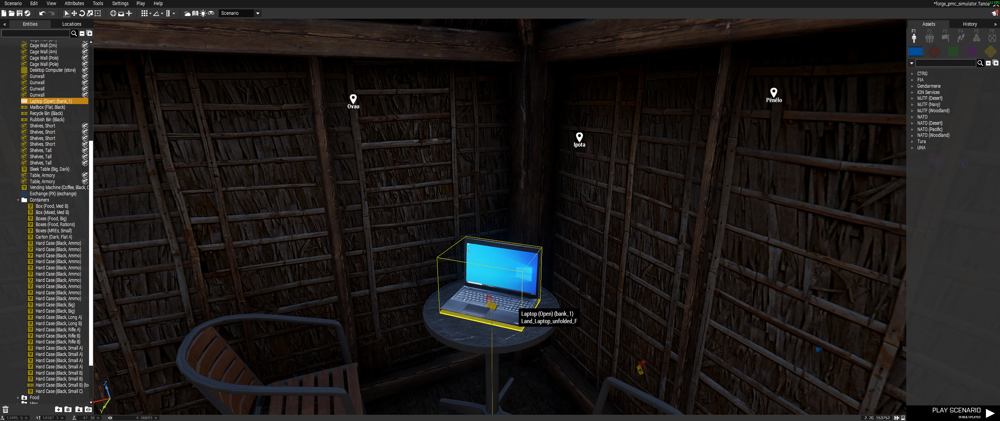


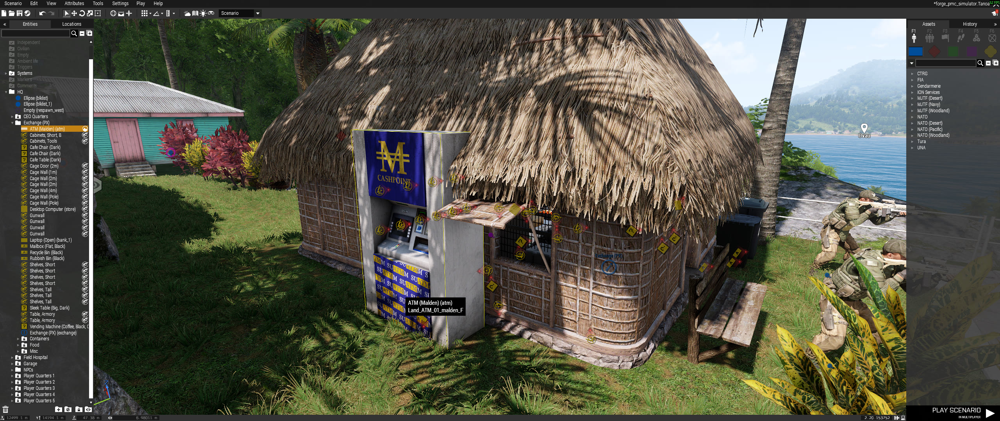

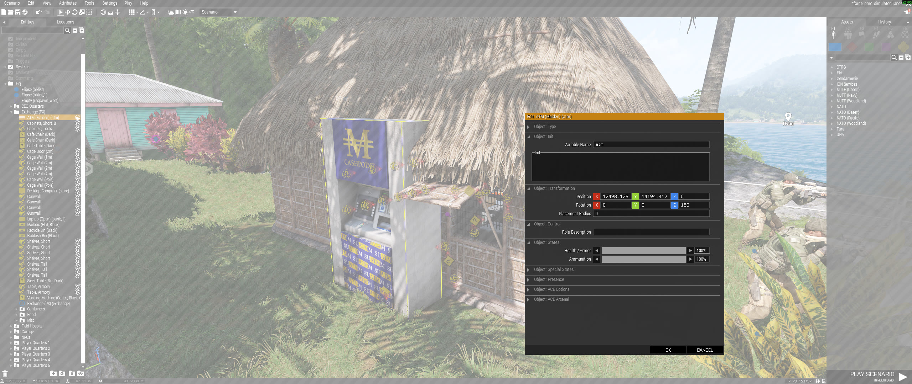

Use a `bank` object for the full bank interface:

- account view
- transfers
- earnings deposit
- PIN change

Use an `atm` object for ATM access:

- PIN-gated account access
- ATM-mode banking actions
- no PIN change

Minimum Eden setup:

1. Place one or more bank laptops or terminals with variable names containing
   `bank`.
2. Place one or more ATM objects with variable names containing `atm`.
3. Keep the object accessible so players can stand within 5 meters.

## Locker Setup

Locker objects are slightly different from other interaction objects. The
server finds editor-placed objects whose variable names contain `locker`, hides
those global objects, and each client creates a local locker object at the same
position using the placed object's classname and orientation.

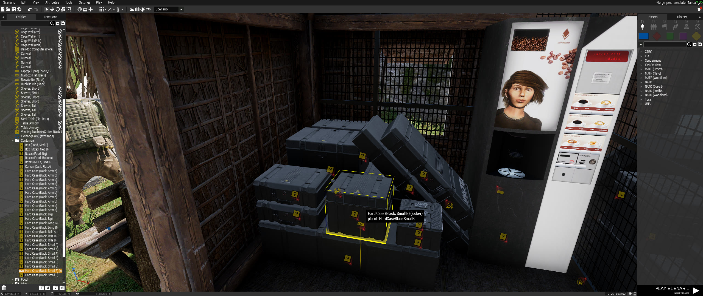

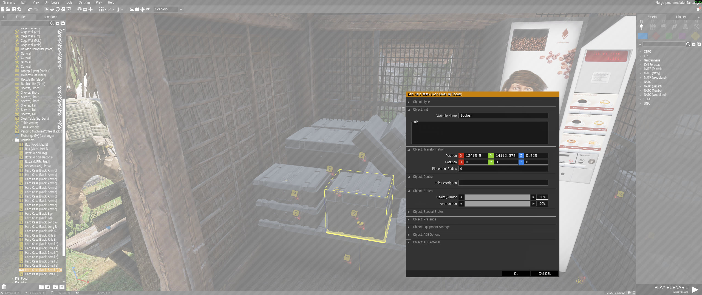

Minimum Eden setup:

1. Place a container object where the locker should appear.
2. Set its Eden variable name to something containing `locker`.
3. Do not use `forge_locker_box`.
4. Test that the local locker appears and opens the virtual arsenal action.

There is no editor-side maximum number of locker access points. Multiple locker
objects on a map create multiple local access clones, but all of those clones
load and save the same UID-owned player locker state. They do not create
separate persistent lockers or cause store grants to duplicate by themselves.

## Medical Spawn Setup

The medical economy store discovers up to eleven medical spawn objects by exact
mission namespace variable name:

- `med_spawn`
- `med_spawn_1`
- `med_spawn_2`
- continuing through `med_spawn_10`

These objects are used for medical respawn placement and occupancy checks.

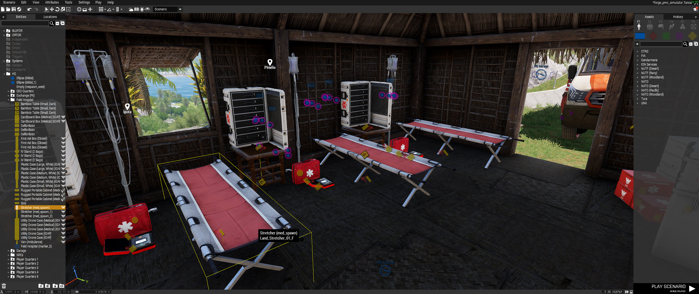

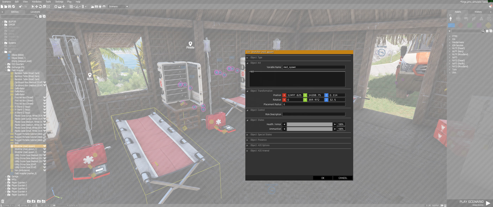

Minimum Eden setup:

1. Place an object at each medical respawn position.
2. Set the first object's Eden variable name to `med_spawn`.
3. Set additional medical spawns to `med_spawn_1`, `med_spawn_2`, and so on.
4. Keep each spawn position clear enough for a revived player to occupy.

## CAD Access

The CAD UI is currently opened from the actor menu action path, but there is no
server initializer that marks Eden objects as dedicated CAD terminals. If a
mission needs a CAD terminal object, wire it through mission script or a custom
interaction that calls:

```sqf
[] spawn forge_client_cad_fnc_openUI;
```

Tasks show in CAD only when they are created through a CAD-compatible task
creation path.

## CEO and Dispatch Slots

Forge grants dispatch-board permissions from the player's Eden unit variable
name when that player belongs to the default organization.

Use these exact lower-case variable names:

| Slot | Eden Unit Variable Name | Permissions |
| --- | --- | --- |
| CEO | `ceo` | Can administer the default organization, use default organization funds where supported, and use the CAD dispatch board. |
| Dispatch | `dispatch` | Can use the CAD dispatch board. |

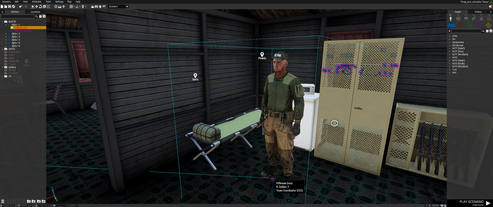

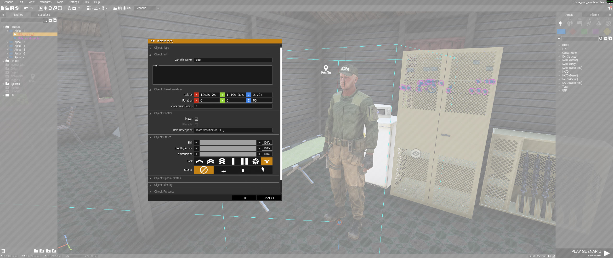

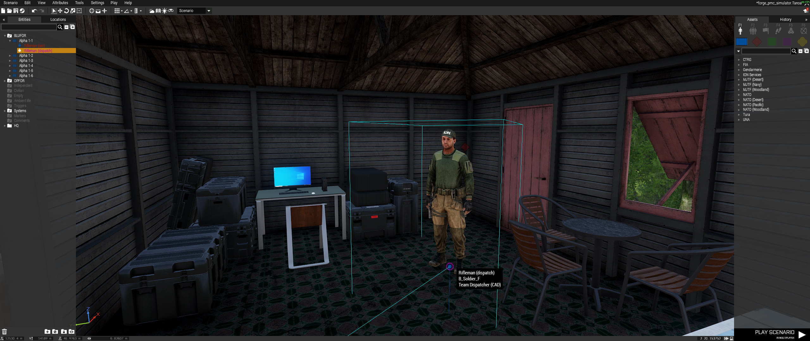

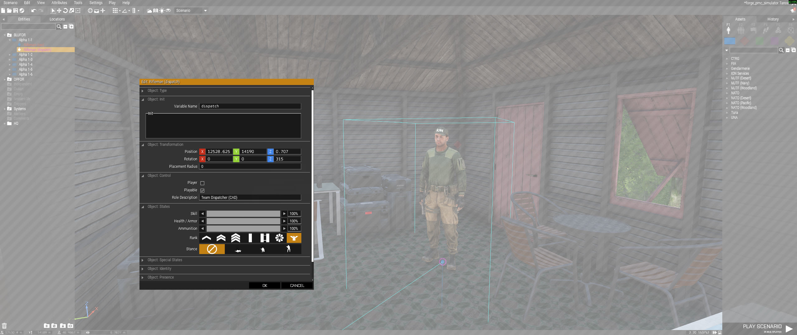

The CEO slot is intentionally broader than the dispatch slot. Use it for the
player who should administrate the default organization. Use the dispatch slot
for players who need dispatcher tools without default organization
administration rights.

## Task and CAD Setup

Mission designers should use Forge Eden task modules for CAD-visible work.
Those modules delegate to `forge_server_task_fnc_startTask`, which creates the
BIS task, registers the Forge task catalog entry, sets active task state, and
dispatches the task handler.

Use the Arma 3 `Create Task` module when you need a standard BIS map task
alongside Forge task handling. Use Forge task modules for CAD-visible task
contracts and runtime task logic.

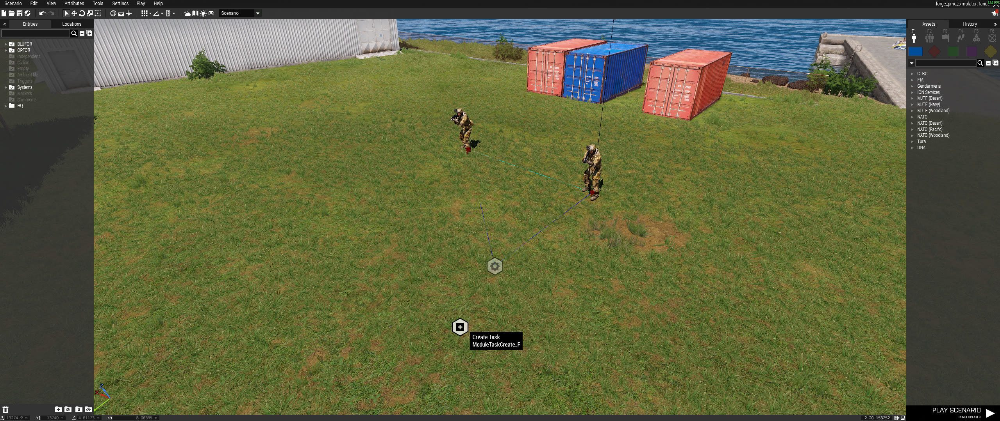

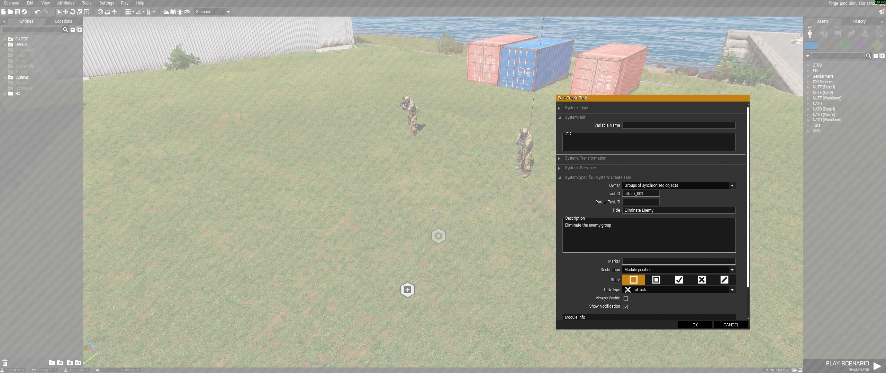

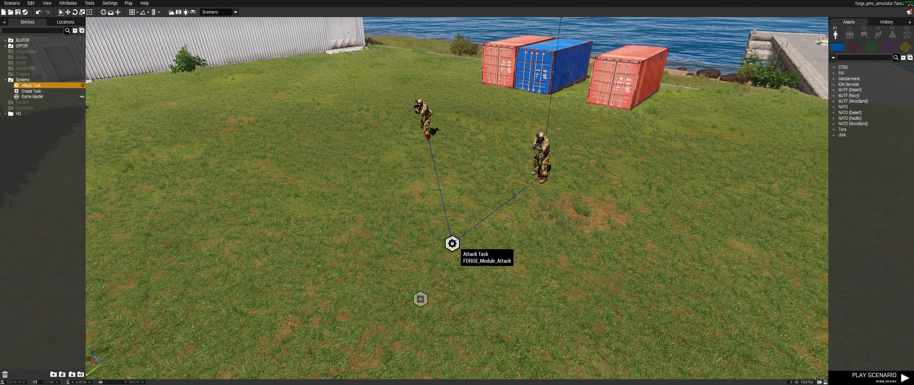

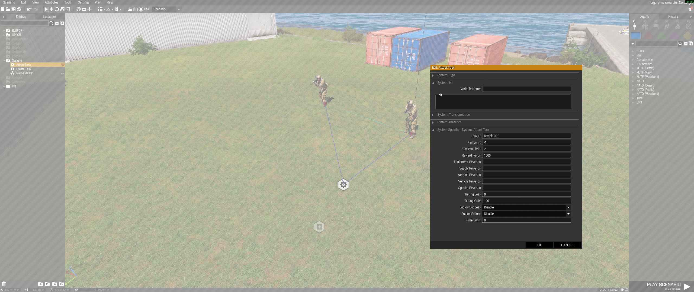

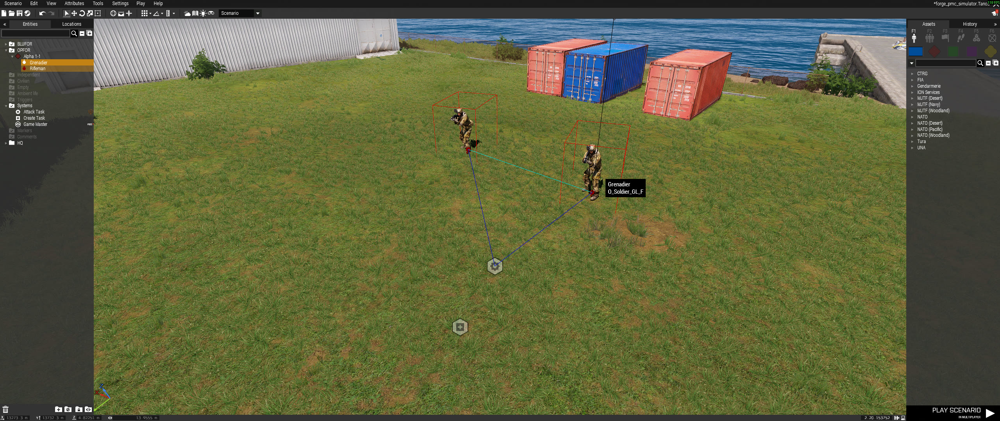

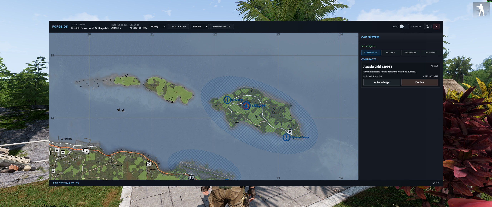

CAD-compatible task creation paths:

| Path | CAD Compatible | Use When |
| --- | --- | --- |
| Forge Eden task modules | Yes | Normal mission-designer workflow. |
| `forge_server_task_fnc_startTask` | Yes | Scripted or generated mission content. |
| Dynamic mission manager attack tasks | Yes | Server-generated attack missions. |
| `forge_server_task_fnc_handler` directly | Only if catalog and BIS task already exist | Advanced scripted flows. |
| Direct task function calls | No by default | Custom server-owned flows that do not need CAD assignment. |

General task rules:

1. Give every task a unique `TaskID`.
2. Set success and fail limits explicitly.
3. Use area markers for zone fields.
4. Use Forge grouping modules where required.
5. Sync task modules to real world objects, units, vehicles, or grouping
   modules.
6. To chain tasks, set `Prerequisite Task IDs` on the dependent task module to
   a comma-separated list of task IDs that must succeed first.
7. Reward class fields use comma-separated class names without brackets, such
   as `ItemGPS, FirstAidKit`. Existing SQF array strings such as
   `["ItemGPS","FirstAidKit"]` still work for older missions.
8. Test that unchained tasks appear in CAD immediately and chained tasks appear
   only after their prerequisite tasks succeed.

Task chaining uses only task IDs. The dependent task is still registered during
mission setup, but it stays hidden from CAD, cannot be assigned, and does not
start its task logic until every prerequisite task has completed successfully.
If any prerequisite task fails or never completes, the dependent task remains
locked.

Zone fields that must reference area markers:


| Field | Used By | Marker Requirement |
| --- | --- | --- |
| `DefenseZone` | Defend Task | Rectangle or ellipse area marker. |
| `DeliveryZone` | Delivery Task | Rectangle or ellipse area marker. |
| `ExtZone` | Hostage and HVT capture tasks | Rectangle or ellipse area marker. |
| `CBRNZone` | Hostage CBRN variant | Rectangle or ellipse area marker. |

## Task Module Setup Guides

Use these task sections as the setup guide and capture plan. Save any new
screenshots under `docus/public/images/eden/` with the listed filenames.

### Attack Task

Use `FORGE_Module_Attack` when players need to eliminate hostile units or
vehicles.

Existing screenshots:

- `attack_task_mod.jpg` - Attack task module placement.
- `attack_task_mod_params.jpg` - Attack task module attributes.
- `attack_task_tgts.jpg` - Attack task synced to target units or vehicles.

Setup:

1. Place the enemy units or vehicles.
2. Place `FORGE_Module_Attack`.
3. Set a unique `TaskID`.
4. Set `LimitSuccess` to the number of targets that must be killed.
5. Set `LimitFail` if the mission should fail after too many losses.
6. Set reward funds, rating gain/loss, end-state behavior, and optional
   `TimeLimit`.
7. Set `Prerequisite Task IDs` only if this attack task should unlock after
   other tasks succeed.
8. Sync the attack module directly to the target units or vehicles.

Validation:

- The task appears in CAD after creation.
- Killing the configured number of targets succeeds the task.
- `TimeLimit` uses seconds; `0` disables the timer.

### Destroy Task

Use `FORGE_Module_Destroy` when players must destroy objects, vehicles, or
units.

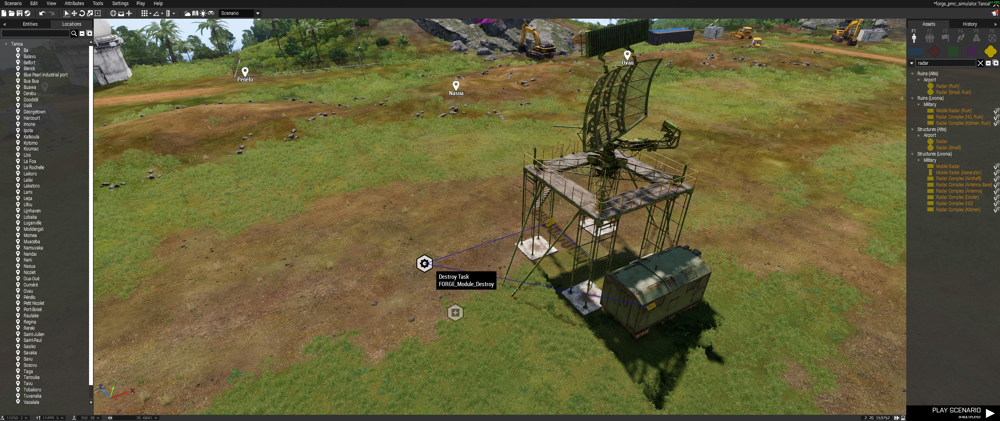

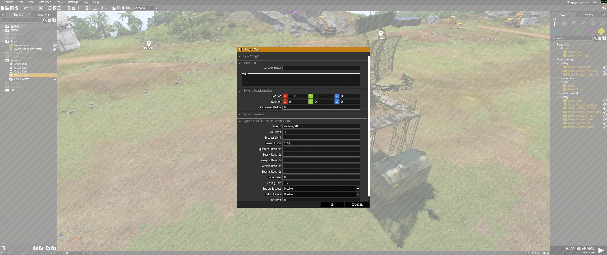

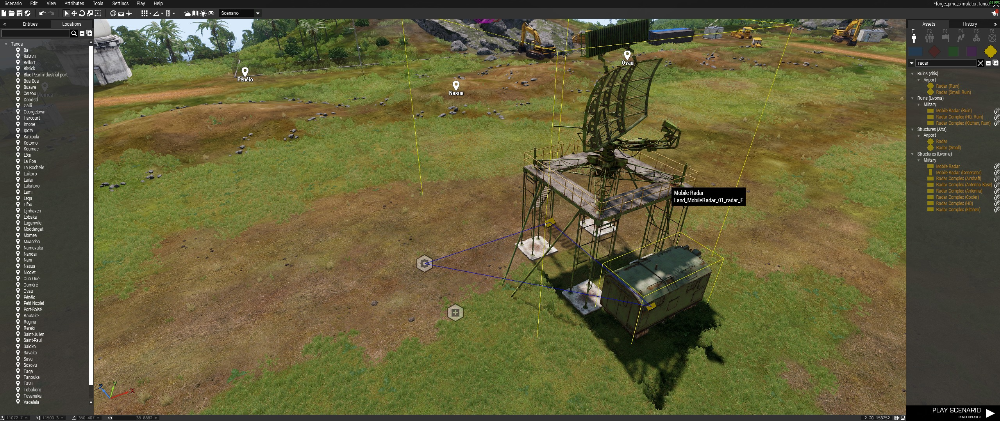

Setup:

1. Place the objects, vehicles, or units that must be destroyed.
2. Place `FORGE_Module_Destroy`.
3. Set a unique `TaskID`.
4. Set `LimitSuccess` to the number of targets that must be destroyed.
5. Set `LimitFail` if the mission should fail after too many protected losses
   or failed conditions.
6. Set reward funds, rating gain/loss, end-state behavior, and optional
   `TimeLimit`.
7. Set `Prerequisite Task IDs` only if this destroy task should unlock after
   other tasks succeed.
8. Sync the destroy module directly to the targets.

Validation:

- The module reads direct syncs only.
- Destroying the configured number of targets succeeds the task.
- `TimeLimit` uses seconds; `0` disables the timer.

### Defuse Task

Use `FORGE_Module_Defuse` when players must defuse explosives while optionally
protecting other entities.

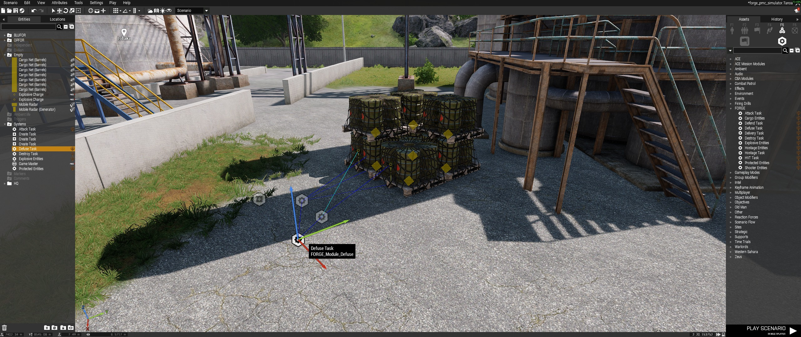

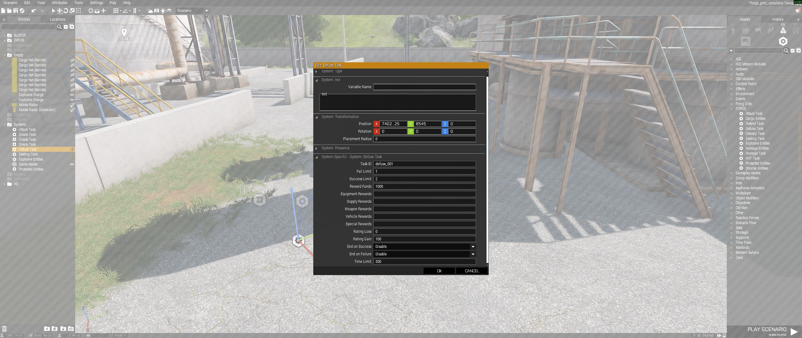

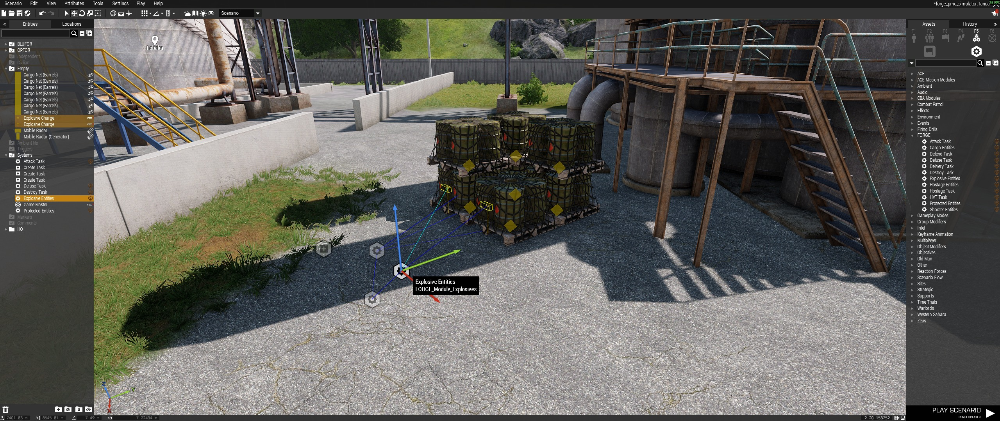

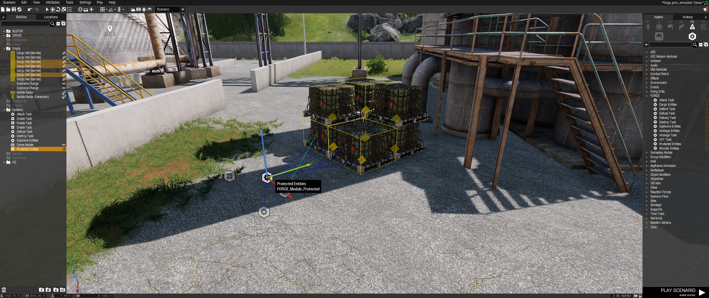

The Defuse task screenshots show both module placement and the required sync
layout.

Required module layout:

```text
[Defuse Task] --> [Explosive Entities] --> explosive objects
[Defuse Task] --> [Protected Entities] --> protected objects, vehicles, or units
```

Setup:

1. Place the explosive objects that players must defuse.
2. Place `FORGE_Module_Explosives`.
3. Sync each explosive object to `FORGE_Module_Explosives`.
4. Place any objects, vehicles, or units that must survive.
5. Place `FORGE_Module_Protected` when protected entities are part of the task.
6. Sync each protected entity to `FORGE_Module_Protected`.
7. Place `FORGE_Module_Defuse`.
8. Set a unique `TaskID`.
9. Set `LimitSuccess` to the number of explosives that must be defused.
10. Set `LimitFail` to the number of protected entities that can be lost before
    failure.
11. Set `TimeLimit` to the IED countdown in seconds.
12. Set reward funds, rating gain/loss, and end-state behavior.
13. Set `Prerequisite Task IDs` only if this defuse task should unlock after
    other tasks succeed.
14. Sync `FORGE_Module_Defuse` to `FORGE_Module_Explosives`.
15. Sync `FORGE_Module_Defuse` to `FORGE_Module_Protected` if used.

Validation:

- The defuse task reads grouped entities, not direct object syncs.
- The ACE defuse event resolves the correct IED for the task.
- Defuse `TimeLimit` is the IED countdown and should be greater than `0`.

### Delivery Task

Use `FORGE_Module_Delivery` when players must move cargo objects into a
delivery zone.

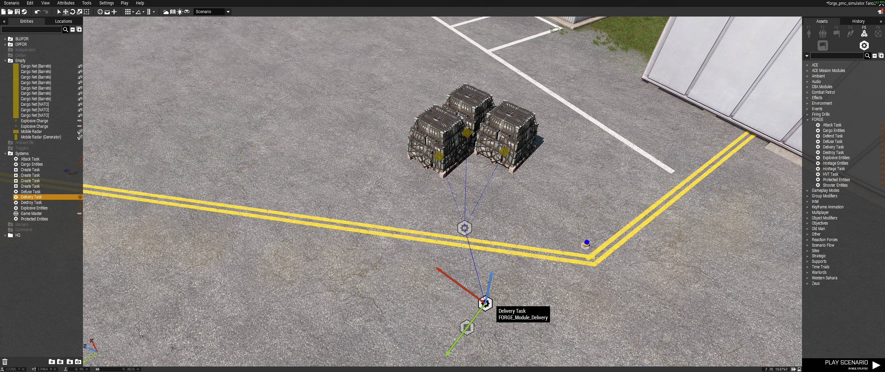

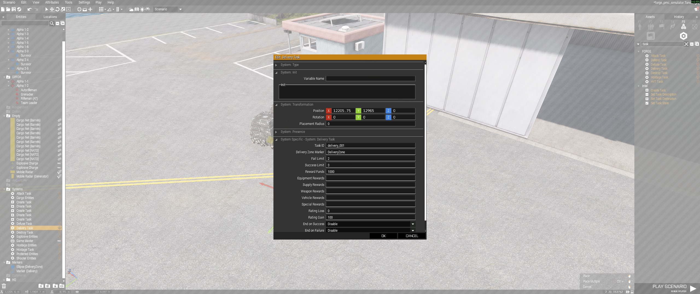

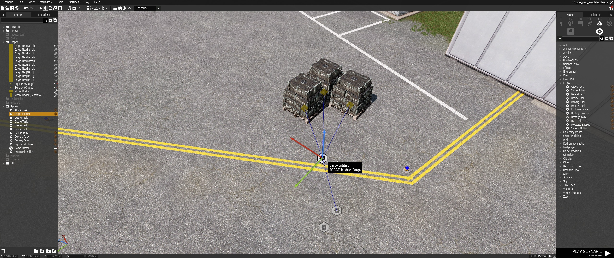

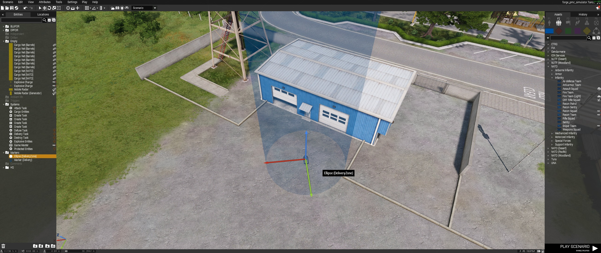

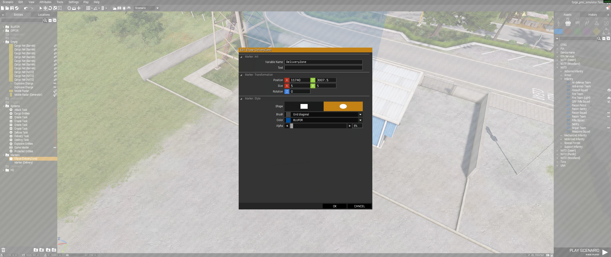

The Delivery task screenshots show both module placement and the required sync
layout.

Required module layout:

```text
[Delivery Task] --> [Cargo Entities] --> cargo objects
```

Setup:

1. Place the cargo objects.
2. Create a rectangle or ellipse area marker for the delivery zone.
3. Place `FORGE_Module_Cargo`.
4. Sync each cargo object to `FORGE_Module_Cargo`.
5. Place `FORGE_Module_Delivery`.
6. Set a unique `TaskID`.
7. Set `DeliveryZone` to the delivery marker name.
8. Set `LimitSuccess` to the number of cargo objects that must arrive.
9. Set `LimitFail` to the number of cargo objects that can be damaged past the
   fail threshold.
10. Set reward funds, rating gain/loss, end-state behavior, and optional
    `TimeLimit`.
11. Set `Prerequisite Task IDs` only if this delivery task should unlock after
    other tasks succeed.
12. Sync `FORGE_Module_Delivery` to `FORGE_Module_Cargo`.

Validation:

- `DeliveryZone` must be an area marker, not an icon marker.
- The runtime checks cargo with `inArea DeliveryZone`.
- The task succeeds only after the configured cargo count reaches the zone.

### Hostage Task

Use `FORGE_Module_Hostage` when players must rescue hostage units and move them
to an extraction zone.


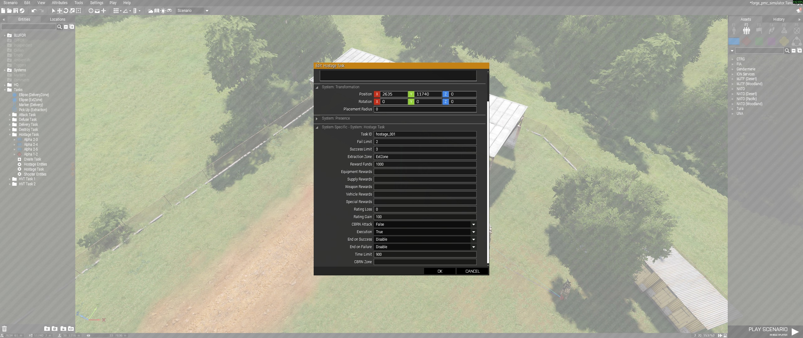

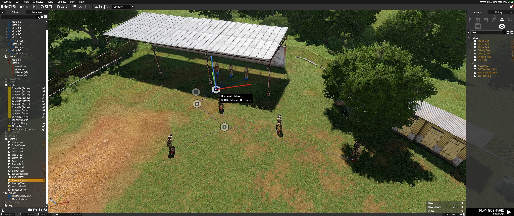

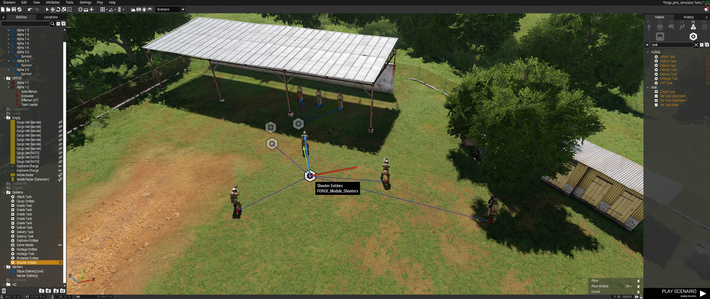


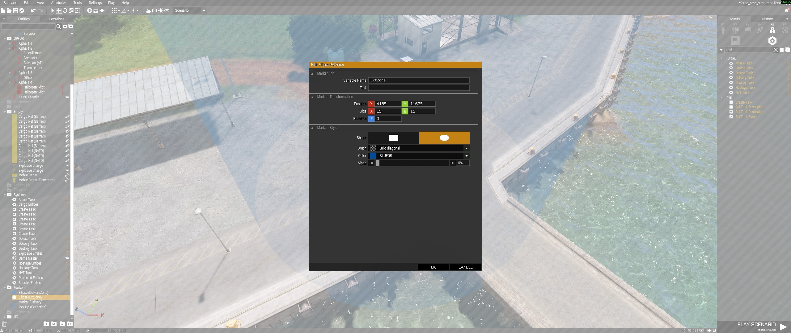

The Hostage task screenshots show both module placement and the required sync
layout.

Required module layout:

```text
[Hostage Task] --> [Hostage Entities] --> hostage units
[Hostage Task] --> [Shooter Entities] --> hostile shooter units
```

Setup:

1. Place the hostage AI units.
2. Place the hostile shooter AI units.
3. Create a rectangle or ellipse area marker for the extraction zone.
4. If using the CBRN variant, create a rectangle or ellipse area marker for
   `CBRNZone`.
5. Place `FORGE_Module_Hostages`.
6. Sync the hostage units to `FORGE_Module_Hostages`.
7. Place `FORGE_Module_Shooters`.
8. Sync the shooter units to `FORGE_Module_Shooters`.
9. Place `FORGE_Module_Hostage`.
10. Set a unique `TaskID`.
11. Set `ExtZone` to the extraction marker name.
12. Set `LimitSuccess` to the number of hostages that must be rescued.
13. Set `LimitFail` to the number of hostages that can be lost before failure.
14. Enable `CBRN Attack` or `Execution` when that mission variant is needed.
15. If `CBRN Attack` is enabled, set `CBRNZone`.
16. Set reward funds, rating gain/loss, end-state behavior, and optional
    `TimeLimit`.
17. Set `Prerequisite Task IDs` only if this hostage task should unlock after
    other tasks succeed.
18. Sync `FORGE_Module_Hostage` to `FORGE_Module_Hostages`.
19. Sync `FORGE_Module_Hostage` to `FORGE_Module_Shooters`.

Validation:

- `ExtZone` and `CBRNZone` must be area markers.
- Hostage and shooter grouping modules should sync to real units only.
- The hostage timer waits until the assigned group leader acknowledges the
  task.

### HVT Task

Use `FORGE_Module_HVT` when players must capture or eliminate high-value target
units. The `HVT Task` example below shows an elimination task. The `HVT Task 1`
example shows a capture/extract task.

Eliminate HVT example:

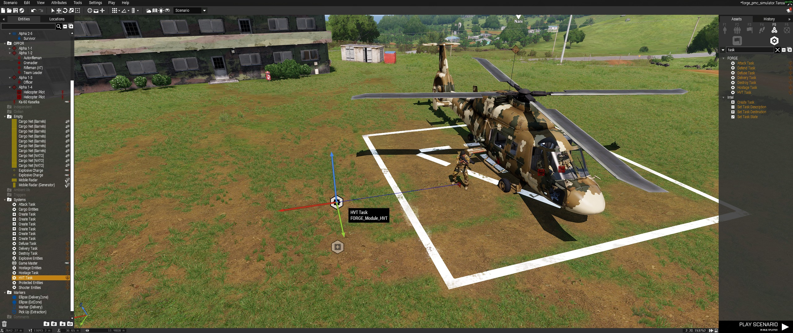

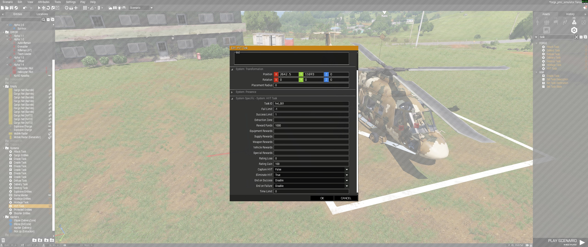

Capture HVT example:

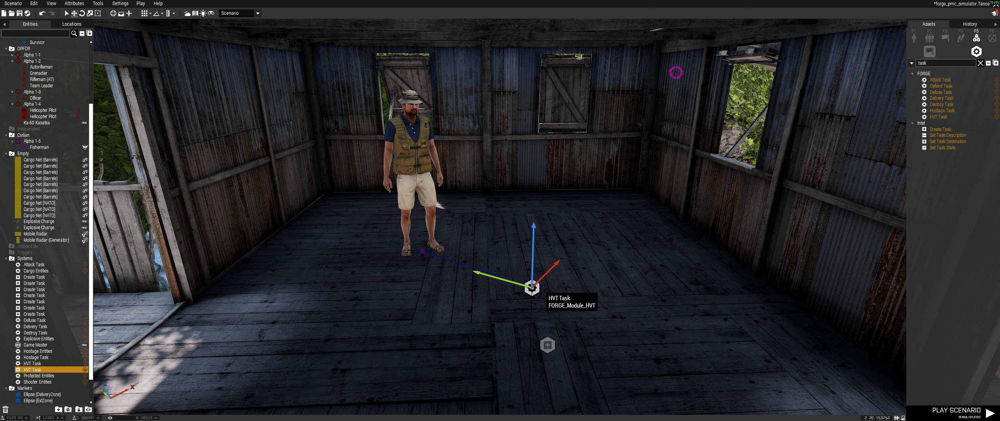

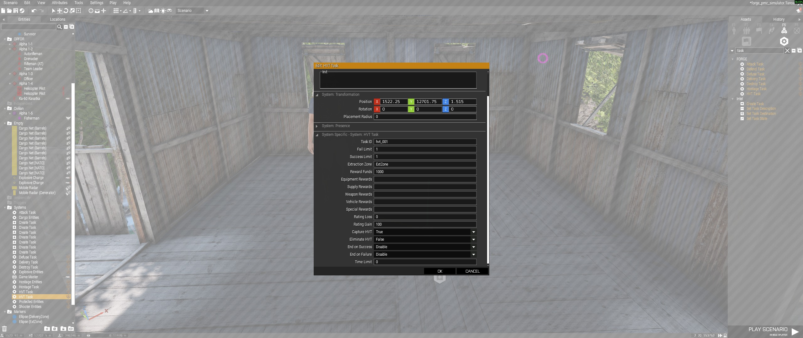

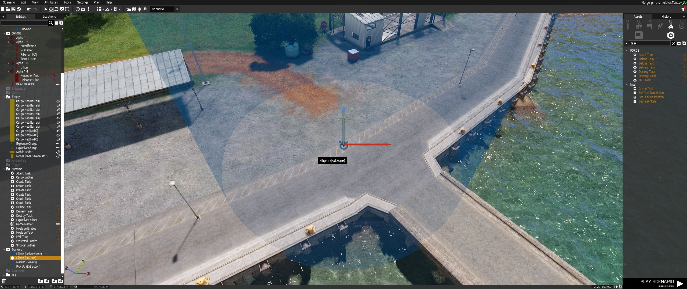


The HVT task screenshots show the direct HVT unit sync for both eliminate and
capture examples.

Setup:

1. Place the HVT unit or units.
2. Place `FORGE_Module_HVT`.
3. Set a unique `TaskID`.
4. For kill/eliminate missions, set `Capture HVT` to `False` and
   `Eliminate HVT` to `True`.
5. For capture/extract missions, set `Capture HVT` to `True` and
   `Eliminate HVT` to `False`.
6. If using capture mode, create a rectangle or ellipse area marker for the
   extraction zone and set `ExtZone` to that marker name.
7. Set `LimitSuccess` to the number of HVTs that must be captured or
   eliminated.
8. Set `LimitFail` if the mission should fail after too many HVT deaths in
   capture mode.
9. Set reward funds, rating gain/loss, end-state behavior, and optional
   `TimeLimit`.
10. Set `Prerequisite Task IDs` only if this HVT task should unlock after other
    tasks succeed.
11. Sync the HVT module directly to the HVT unit or units.

Validation:

- Capture mode requires `ExtZone`; elimination mode does not.
- `ExtZone` must be an area marker.
- The HVT timer waits until the assigned group leader acknowledges the task.

### Defend Task

Use `FORGE_Module_Defend` when players must hold an area against spawned enemy
waves.

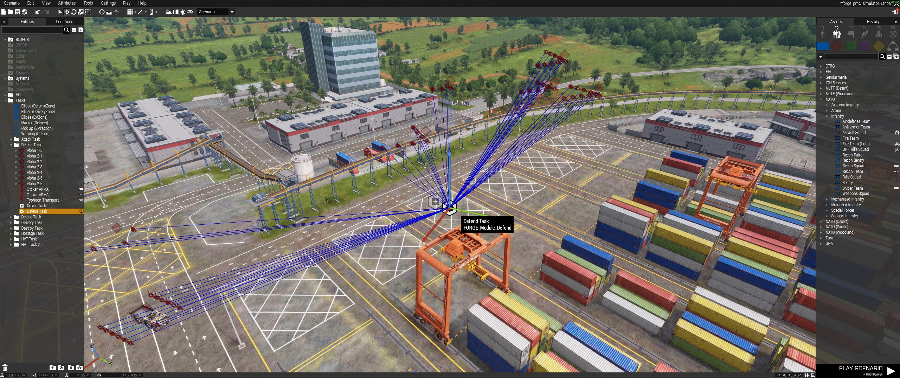

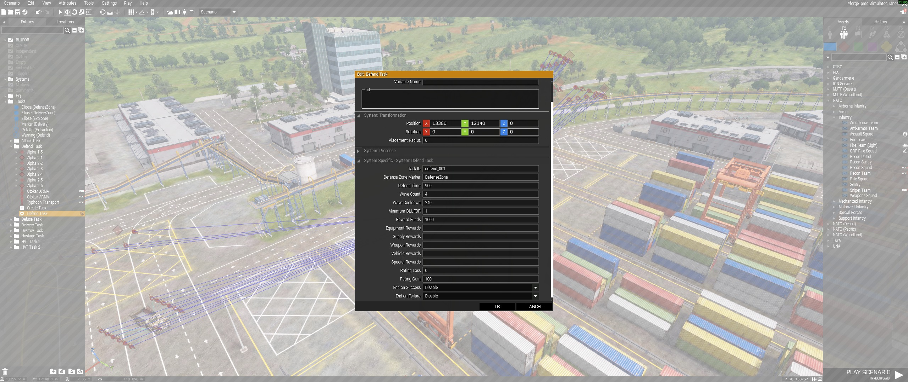

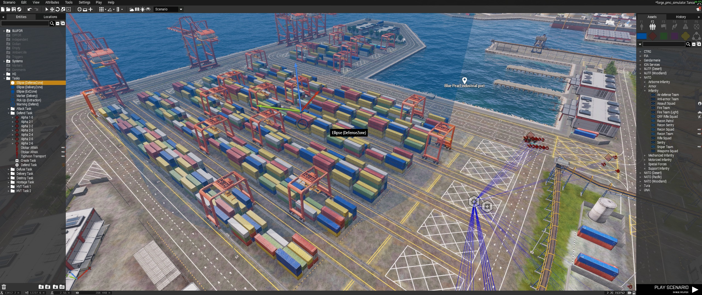

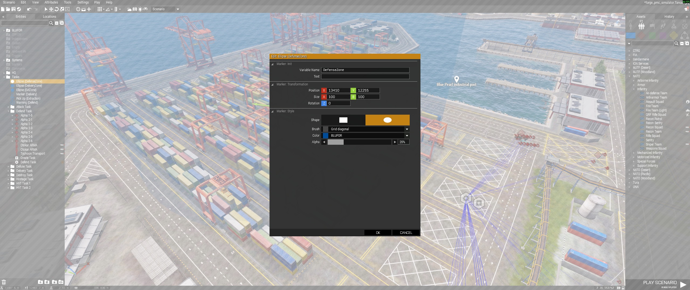

The Defend task screenshots show module placement, marker setup, enemy wave
templates, and the required sync layout.

Setup:

1. Create a rectangle or ellipse area marker for the defense zone.
2. Place `FORGE_Module_Defend`.
3. Set a unique `TaskID`.
4. Set `DefenseZone` to the defense marker name.
5. Set `DefendTime` to how long the area must be held.
6. Set `WaveCount`.
7. Set `WaveCooldown`.
8. Set `MinBlufor` to the minimum number of friendly players or units required
   in the zone.
9. Place one or more enemy groups or units to use as wave templates.
10. Sync any unit from each enemy group to the defend module.
11. Set reward funds, rating gain/loss, and end-state behavior.
12. Set `Prerequisite Task IDs` only if this defend task should unlock after
    other tasks succeed.

Validation:

- `DefenseZone` must be an area marker.
- Syncing one unit from an enemy group makes the whole group available as a
  wave composition.
- If no enemy units are synced, the task falls back to default CSAT infantry
  waves.
- The timer, waves, and empty-zone failure checks start after enough BLUFOR
  enter the zone.

## Task Module Quick Reference

| Task Module | Sync Target | Required Marker |
| --- | --- | --- |
| `FORGE_Module_Attack` | Target units or vehicles | None |
| `FORGE_Module_Destroy` | Target objects, vehicles, or units | None |
| `FORGE_Module_Defuse` | `FORGE_Module_Explosives`, optionally `FORGE_Module_Protected` | None |
| `FORGE_Module_Delivery` | `FORGE_Module_Cargo` | `DeliveryZone` |
| `FORGE_Module_Hostage` | `FORGE_Module_Hostages` and `FORGE_Module_Shooters` | `ExtZone`, optional `CBRNZone` |
| `FORGE_Module_HVT` | HVT units | `ExtZone` when capture mode is enabled |
| `FORGE_Module_Defend` | Optional enemy units as wave templates | `DefenseZone` |

## Mission Manager Blacklist Markers

The dynamic mission generator avoids rectangle and ellipse area markers whose
marker name or marker text starts with `blklist`.

Use blacklist area markers to keep generated missions out of bases, spawn
areas, training zones, or protected set pieces.

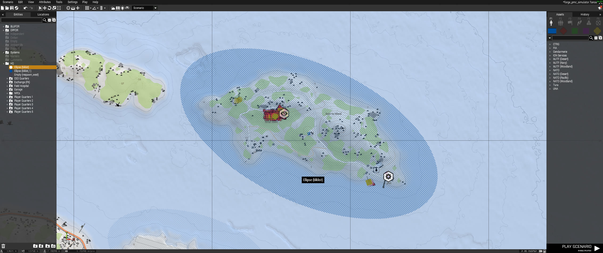

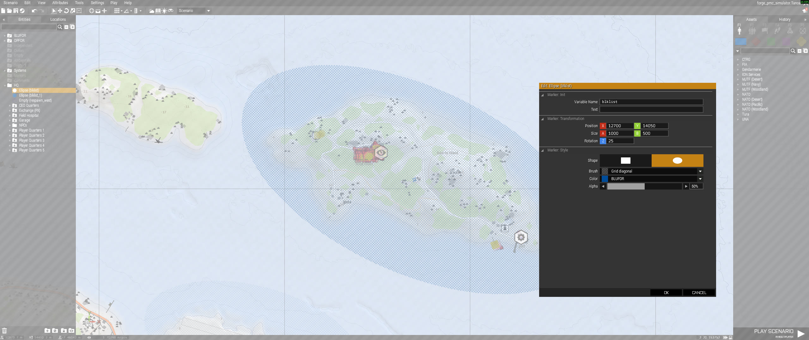

Setup:

1. Create a rectangle or ellipse area marker over the area to exclude.
2. Set the marker variable name or marker text to start with `blklist`.
3. Give the marker real size so the generator can test candidate positions
   against the area.

## Task Setup Checklist

Before publishing a mission, verify:

- Every task has a unique `TaskID`.
- Every configured marker name exists in Eden.
- Zone markers are area markers, not icon-only markers.
- Grouping modules are synced in the correct direction.
- Success and fail limits match the number of required entities.
- Reward funds and rating changes are intentional.
- Unchained tasks appear in CAD when created.
- Chained tasks remain hidden until all prerequisite task IDs succeed.
- Assigned CAD tasks can be acknowledged, declined, and completed.

## Mission Validation Checklist

Run this checklist in a local multiplayer test:

- Stand within 5 meters of each bank object and verify the full bank action.
- Stand within 5 meters of each ATM and verify ATM mode.
- Confirm PIN changes are only available from the full bank interface.
- Stand near each store object and complete a test checkout.
- Stand near each locker and verify the local locker/arsenal opens.
- Open each garage and retrieve/store a vehicle.
- Open each virtual garage category and confirm the correct spawn marker is
  used.
- Block a garage spawn marker with a vehicle and confirm the warning appears.
- Create each mission task and confirm CAD visibility.
- Assign a task in CAD and verify the player flow through completion or failure.

## Eden Screenshot Set

The live docs should include real Eden screenshots for mission designers. When
capturing them, save the images under `docus/public/images/eden/` and use these
filenames so the docs can reference stable assets:

| File | Capture |
| --- | --- |
| `bank_obj.jpg`, `bank_obj_var.jpg` | Bank object placement and variable name. |
| `atm_obj.jpg`, `atm_obj_var.jpg` | ATM object placement and variable name. |
| `store_obj.jpg`, `store_obj_var.jpg` | Store object placement and variable name. |
| `locker_obj.jpg`, `locker_obj_var.jpg` | Locker container placement and variable name. |
| `garage_obj.jpg`, `garage_obj_var.jpg` | Garage interaction object placement and variable name. |
| `garage_spawn_mrkrs.jpg`, `garage_spawn_1_mrkr_var.jpg` | Garage category spawn markers and marker variable naming. |
| `garage_obj_2.jpg`, `garage_obj_2_var.jpg`, `garage_spawn_2_mrkrs.jpg` | Additional garage site placement, variable name, and spawn markers. |
| `med_spawn_obj.jpg`, `med_spawn_obj_var.jpg` | Medical spawn object placement and variable name. |
| `ceo_unit.jpg`, `ceo_unit_var.jpg` | CEO playable unit placement and variable name. |
| `dispatch_unit.jpg`, `dispatch_unit_var.jpg` | Dispatch playable unit placement and variable name. |
| `blacklist_mrkr.jpg`, `blacklist_mrkr_var.jpg` | Mission-manager blacklist marker placement and marker variable naming. |
| `create_task_mod.jpg`, `create_task_mod_params.jpg` | Arma 3 Create Task module placement and parameters. |
| `attack_task_mod.jpg`, `attack_task_mod_params.jpg`, `attack_task_tgts.jpg` | Attack task module placement, parameters, and target sync. |
| `destroy_task_mod.jpg`, `destroy_task_mod_params.jpg`, `destroy_task_tgts.jpg` | Destroy task module placement, parameters, and target sync. |
| `defuse_task_mod.jpg`, `defuse_task_mod_params.jpg` | Defuse task module placement and parameters. |
| `defuse_explosives_mod.jpg`, `defuse_protected_mod.jpg` | Defuse grouping modules for explosive and protected entities. |
| `delivery_task_mod.jpg`, `delivery_task_mod_params.jpg`, `delivery_cargo_mod.jpg` | Delivery task module, parameters, and Cargo Entities grouping module. |
| `delivery_zone_mrkr.jpg`, `delivery_zone_mrkr_var.jpg` | Delivery area marker placement and marker name. |
| `hostage_task_mod.jpg`, `hostage_task_mod_params.jpg` | Hostage task module placement and parameters. |
| `hostage_entities_mod.jpg`, `hostage_shooters_mod.jpg` | Hostage grouping modules for hostage and shooter units. |
| `hostage_ext_zone_mrkr.jpg`, `hostage_ext_zone_mrkr_var.jpg` | Hostage extraction marker placement and marker name. |
| Hostage CBRN marker | Use the same extraction-marker capture pattern if a separate CBRN screenshot is ever needed. |
| `hvt_task_mod.jpg`, `hvt_task_mod_params.jpg` | HVT eliminate task module placement and parameters. |
| `hvt_capture_task_mod.jpg`, `hvt_capture_task_mod_params.jpg` | HVT capture task module placement and parameters. |
| `hvt_ext_zone_mrkr.jpg`, `hvt_ext_zone_mrkr_var.jpg` | HVT capture extraction marker placement and marker name. |
| `defend_task_mod.jpg`, `defend_task_mod_params.jpg` | Defend task module placement, parameters, wave templates, and sync. |
| `defend_zone_mrkr.jpg`, `defend_zone_mrkr_var.jpg` | Defense area marker placement and marker name. |
| `cad-visible-task.jpg` | In-game CAD showing a task created from the Eden module. |

Use screenshots that show the Eden left-side entity list, the selected object's
attributes panel, and the map placement where possible. Crop only enough to
remove unrelated mission content.

## Related Guides

- [Task Usage Guide](./TASK_USAGE_GUIDE.md)
- [Client Actor Usage Guide](./CLIENT_ACTOR_USAGE_GUIDE.md)
- [Client Garage Usage Guide](./CLIENT_GARAGE_USAGE_GUIDE.md)
- [Client Locker Usage Guide](./CLIENT_LOCKER_USAGE_GUIDE.md)
- [Store Usage Guide](./STORE_USAGE_GUIDE.md)
- [Bank Usage Guide](./BANK_USAGE_GUIDE.md)
- [Client CAD Usage Guide](./CLIENT_CAD_USAGE_GUIDE.md)
