# Player Guide

Use this guide as the player-facing overview for Forge systems. It explains
what players interact with during normal missions, how task assignment works,
and what persistent storage limits apply.

## Opening Forge Interactions

Most Forge actions are opened from the actor interaction menu while standing
near a configured mission object.

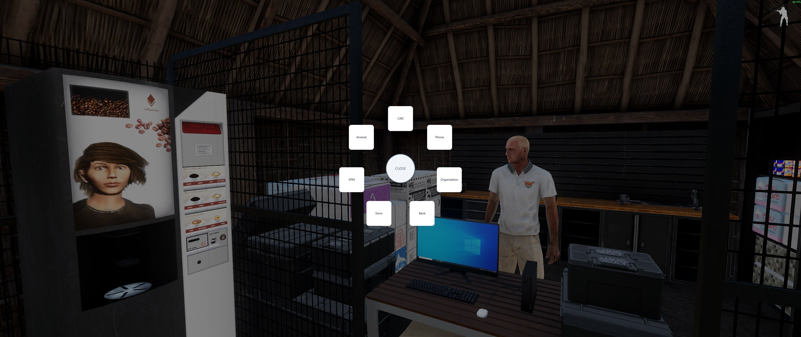

Press `Tab` by default to open the custom interaction menu. Server settings or
local keybind changes may use a different key.

Known current behavior: after closing the custom interaction menu, players may
need to press `Tab` twice before it opens again. Treat this as a temporary
workaround until the interaction menu focus behavior is investigated further.

Players usually need to be within 5 meters of an interaction object such as a
bank terminal, ATM, store counter, garage terminal, or locker.

## CAD and Tasks

CAD is the main task and dispatch system. It is used for mission contracts,
group status, support requests, dispatch orders, and task assignment.

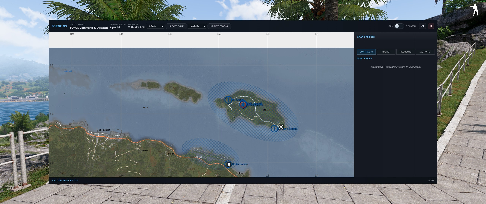

Player workflow:

1. Open CAD from the available interaction path.
2. Review available or assigned tasks.
3. If a dispatcher assigns a task to your group, the group leader must
   acknowledge or decline it.
4. Once acknowledged, the task becomes active for the assigned group.
5. Complete the task objective shown by CAD, map task state, and mission
   instructions.

Map focus behavior:

- Click an assigned or accepted task in the operations task board to center the
  map on that task.
- Click a roster member to center the map on that player.
- Click a support request to center the map on the request location.
- Dispatch map mode supports the same focus behavior for groups, contracts,
  and support requests.

Dispatch workflow:

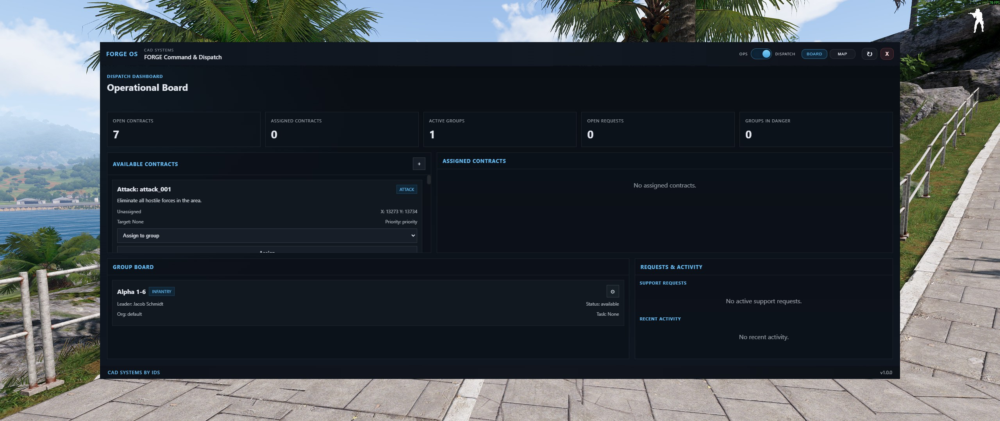

1. Open CAD with a dispatcher-enabled slot or permission.
2. Use dispatch mode to review groups, open contracts, assigned contracts, and
   support requests.
3. Assign available contracts to active groups.
4. Send dispatch orders or close completed orders as needed.
5. Track group status and recent CAD activity.

Dispatch access:

- The CEO slot can administer the default organization and use CAD dispatch
  permissions.
- The Dispatch slot grants CAD dispatch permissions without default
  organization administration rights.
- Players who are the CEO or owner of their own organization also receive CAD
  dispatch permissions.

Important task behavior:

- CAD assignment reserves a task for a group.
- The task starts after the assigned group leader acknowledges it.
- If the leader declines, the task returns to the open contract board.
- Some task timers wait for group-leader acknowledgment before counting down.

## Phone

The phone provides contacts, messages, email, mobile bank access, and local
utility apps.

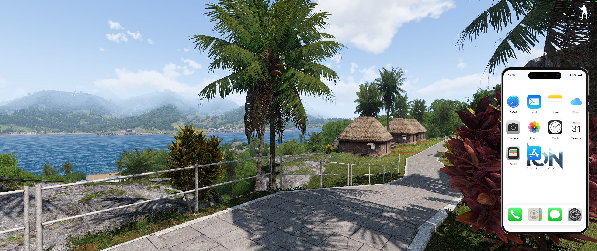

### Contacts

Use Contacts to keep track of other players by phone number or email address.
Adding contacts makes it easier to start messages and emails without manually
entering recipient details every time.

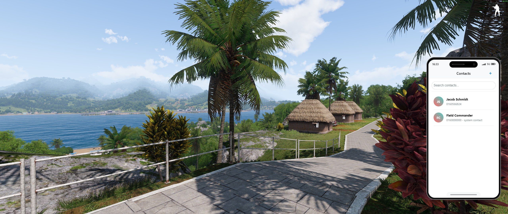

### Messages

Messages are short player-to-player conversations. Use Messages to start or
continue a conversation with a contact, read incoming messages, mark messages as
read, or delete messages you no longer need.

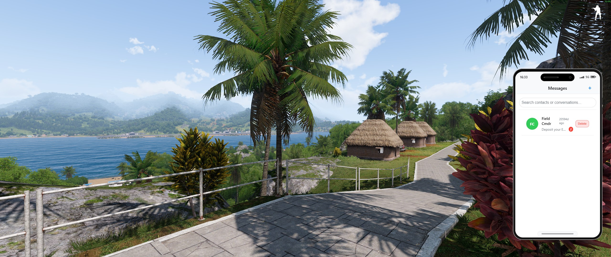

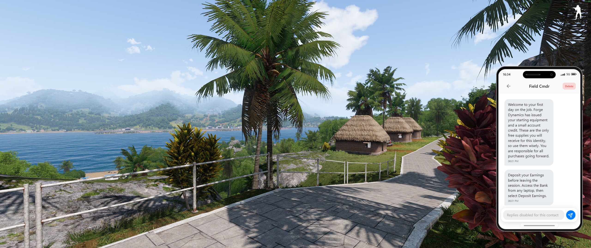

### Email

Email is used for longer player-to-player communication. Use Email to send a
subject and body to another player, read incoming mail, mark email as read, or
delete old email.

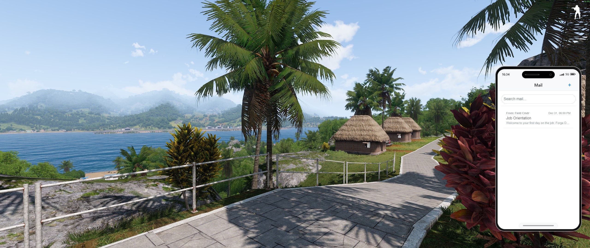

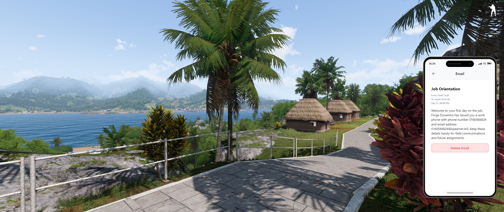

### Wallet

Wallet is the phone version of the bank app. Use it to refresh your account
view, check your available balance, review cash and pending earnings, deposit all
pending earnings, and pay your organization credit line when payment is due.

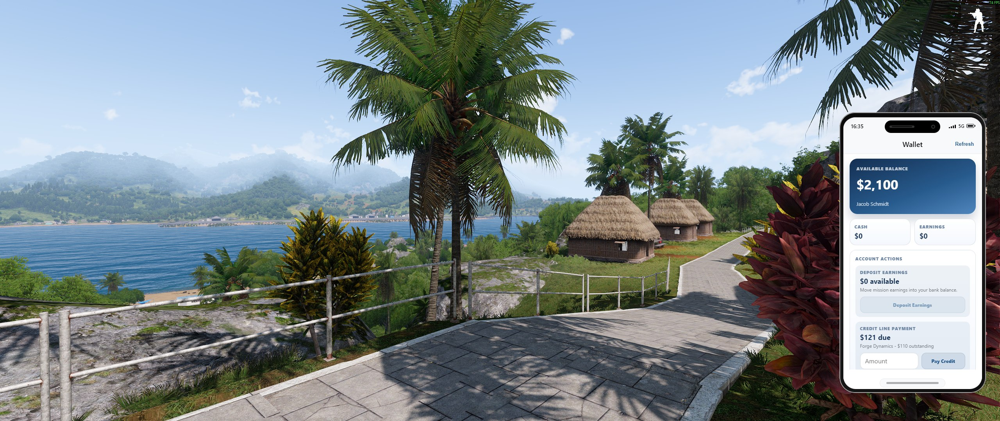

Deposit Earnings deposits the full pending earnings amount. Players do not enter
a custom amount for that action.

### Local Phone Apps

Notes, calendar events, clocks, alarms, and theme preferences are local utility
features. They are saved for the local player profile and should not be treated
as shared multiplayer data.

## Bank and ATM

Bank and ATM access are separate.

Use a bank object for full banking:

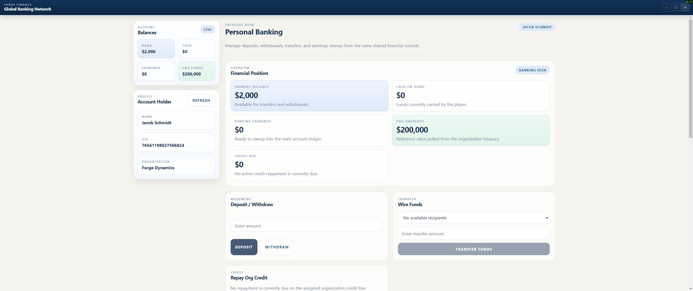

- view account information
- transfer funds
- deposit earnings
- change PIN

Use an ATM for limited account access:

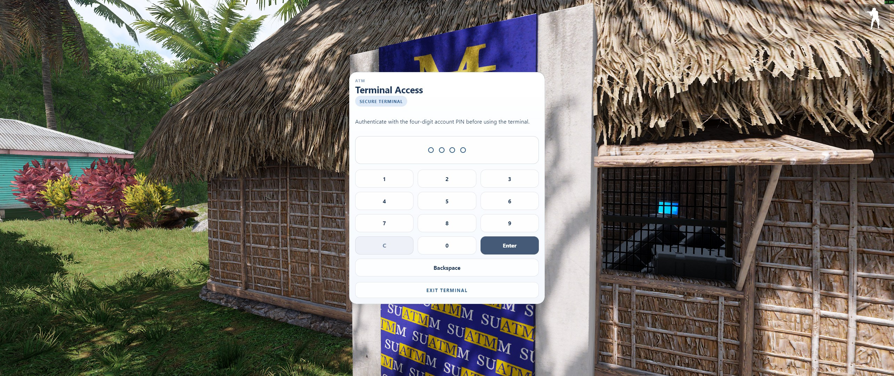

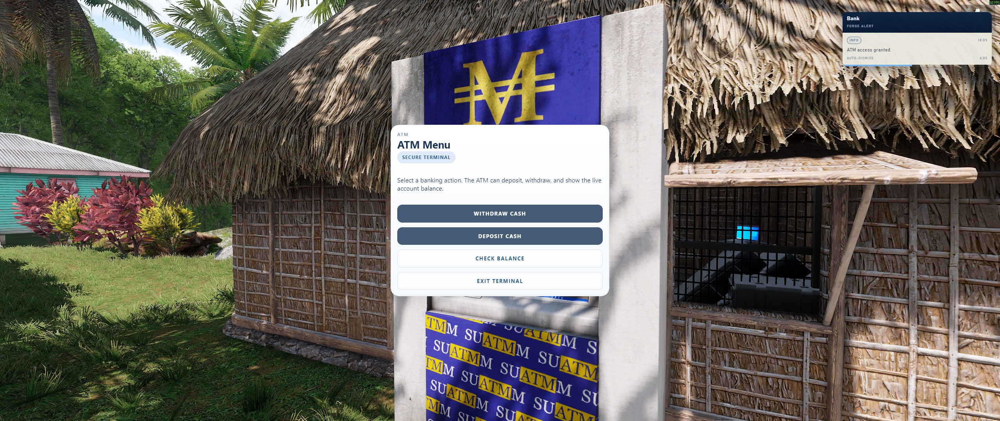

- PIN-gated account actions
- ATM banking workflows
- no PIN changes

If a PIN prompt appears, enter the correct PIN before attempting account
actions.

## Organizations

Players start in the default organization. A player can create a player-owned
organization only if they have `$50,000` available for the registration fee.
Organization access depends on the player's role.

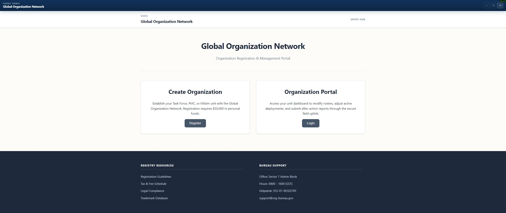

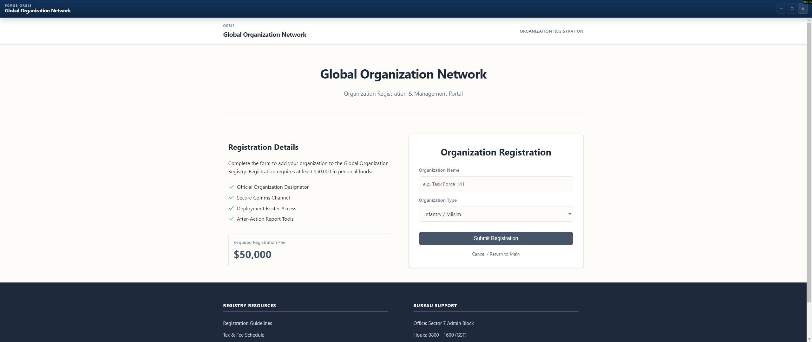

Default organization:

- The `ceo` slot can administer the default organization.
- The `dispatch` slot receives CAD dispatch permissions, but does not receive
  default organization administration rights.

Player-owned organizations:

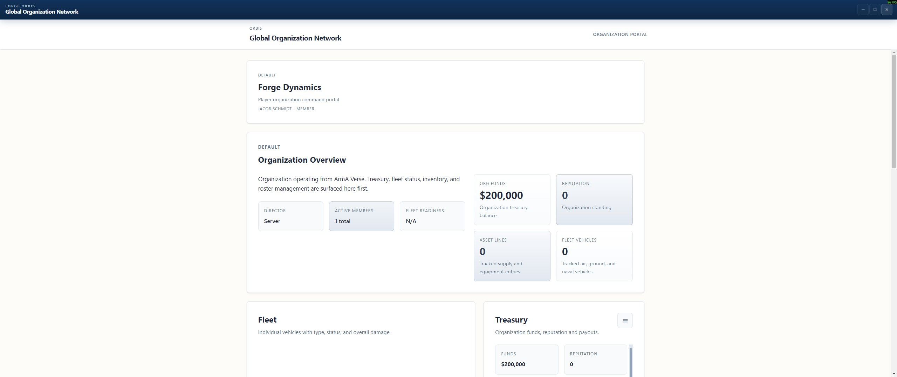

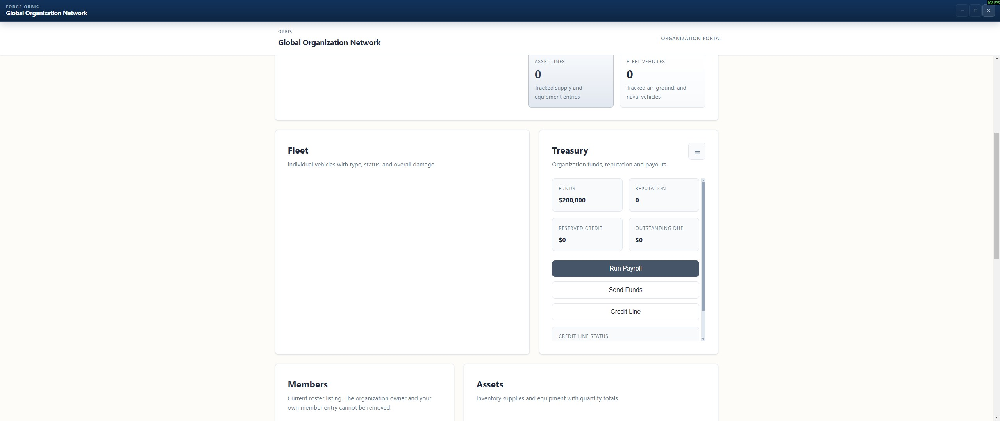

- The player who created the organization is its owner or CEO.
- The owner can administer the organization, including treasury and roster
  actions exposed by the organization interface.
- Organization owners can invite players, manage members, assign credit lines,
  transfer funds or run payroll when funds are available, and disband the
  organization.
- Organization owners can use organization funds for supported store purchases.
- Members may receive assigned credit lines, accept or decline organization
  invites, and leave the organization.
- The organization CEO or owner cannot leave their own organization directly.
  They must disband the organization if they want to leave it.

Organization actions are server-authoritative. If an organization action fails,
check that the player has the correct role, the player or organization has
enough funds, and the target player is eligible for the action.

## Store

Stores sell unlocks and equipment through the configured server-side catalog.

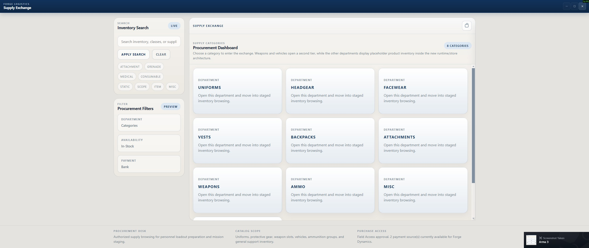

Store purchases may grant:

- items or equipment added to the locker
- matching gear unlocks in the virtual arsenal
- vehicle unlocks in the virtual garage
- other mission-configured rewards

Store purchases are server-authoritative. If a purchase succeeds, the relevant
bank, locker, virtual arsenal, virtual garage, or organization state updates
from the server.

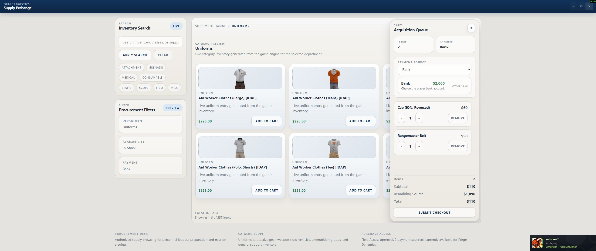

Vehicle purchases unlock the vehicle in the virtual garage. They do not place a
physical vehicle into the player's 5-slot garage. Use the virtual garage to
spawn an unlocked vehicle, and use the garage to store or retrieve live world
vehicles.

## Transport

Transport points let players pay to travel between configured mission locations.
They may represent ferries, terminals, air shuttles, or other mission-specific
travel points.

Player workflow:

1. Stand near a transport point.
2. Open the actor interaction menu.
3. Select Transport.
4. Select a destination from the transport submenu, or select Close to return
   to the default interaction menu.

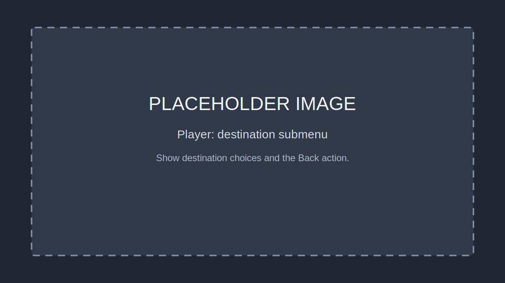

The destination price is based on distance. The server charges player bank
first, player cash second, then organization credit line fallback when
available. If payment succeeds, the player is moved to the selected arrival
point. Nearby eligible vehicles or passengers may be moved with the player when
the mission has configured the transport point for cargo movement.

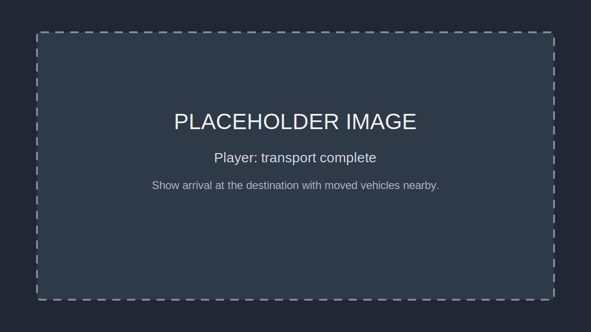

## Locker and Virtual Arsenal

The locker is personal item storage.

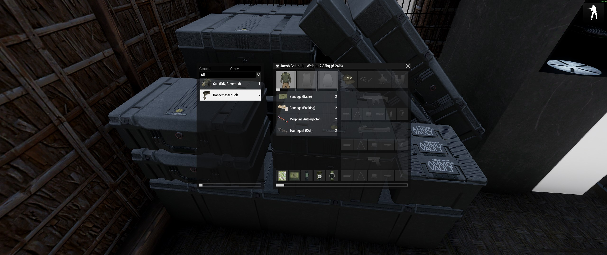

Locker rules:

- Up to 25 items can be stored.
- The locker saves when the locker container is closed.
- Over-capacity storage can warn or fail depending on server handling.
- Multiple locker access points on the map open local copies of the locker
  object, but all of them use the same personal locker inventory.
- Store purchases merge granted items into the same personal locker by
  classname; extra locker objects on the map do not duplicate store grants.

The virtual arsenal is locked down. Players only see gear they have been
granted or have unlocked through systems such as the store. The virtual arsenal
is not intended to expose the full unrestricted Arma arsenal.

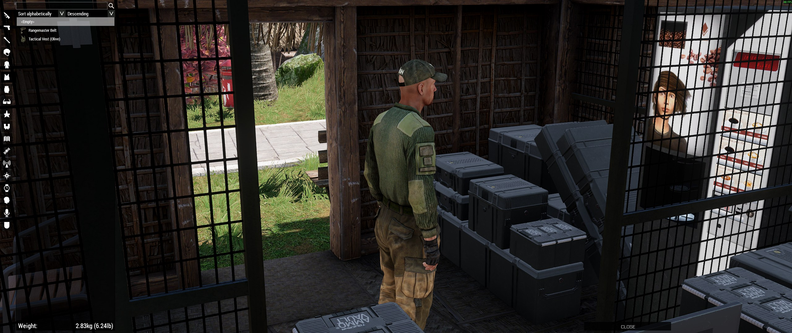

## Garage and Virtual Garage

The garage stores physical player vehicles that have been saved from the world.

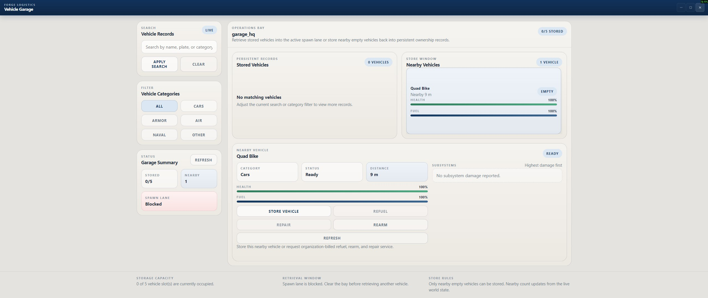

Garage rules:

- Up to 5 vehicles can be stored.
- Stored vehicles can be retrieved from a garage interaction point.
- Retrieved vehicles become live world vehicles again.
- Vehicle service actions operate on live nearby vehicles, not vehicles that
  are still stored.

The virtual garage is locked down. Players only see vehicles they have been
granted or have unlocked through systems such as the store. Virtual garage
unlocks are separate from the 5 physical vehicle slots in the garage. The
virtual garage uses mission-configured spawn lanes, and spawning may be blocked
if the spawn position is occupied.

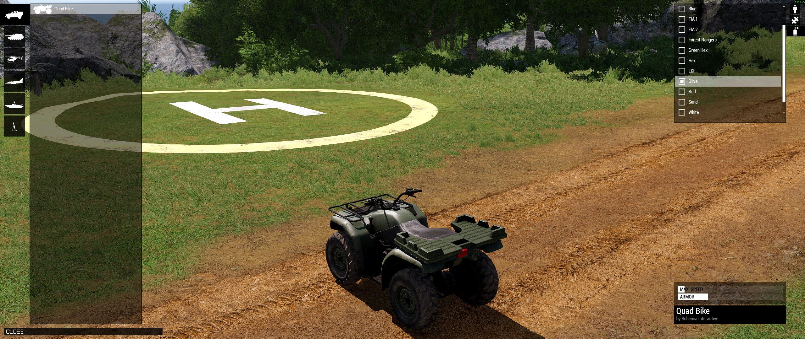

## Economy Services

Economy services are server-controlled. Charges must succeed before the world
effect is applied.

### Medical

Medical services are player-funded first.

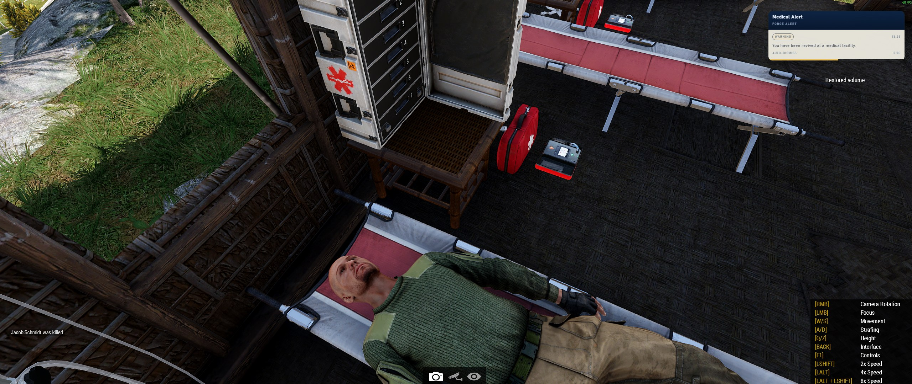

Billing order:

1. Player bank balance.
2. Player cash.
3. Organization funds, when allowed by the server.
4. Organization credit-line debt for the player when organization fallback is
   used.

Medical respawn placement uses mission-configured medical spawn objects.

### Refuel

Refuel service is organization-funded. If the organization cannot cover the
cost, the vehicle is not refueled or the fuel level is rolled back.

Refuel is available from the garage app dashboard shown above.

### Repair

Repair service is organization-funded. The repair is only applied after the
organization charge succeeds.

Repair is available from the garage app dashboard shown above.

### Rearm

If the mission exposes rearm service through the economy or support workflow,
expect it to follow the same server-authoritative pattern: the service request
must be accepted and billed before equipment or vehicle state changes are
applied.

Rearm is available from the garage app dashboard shown above.

## Common Player Checks

If a system does not appear or does not work:

- Move closer to the interaction object.
- Confirm you are using the correct object type, such as ATM vs bank.
- Confirm your group leader has acknowledged an assigned CAD task.
- Confirm the needed store unlock has been purchased before checking VA or VG.
- Confirm the garage spawn point is clear before using the virtual garage.
- Confirm your player, cash, bank, or organization funds can cover the service.

## Related Guides

- [Mission Designer Guide](./MISSION_DESIGNER_GUIDE.md)
- [Client CAD Usage Guide](./CLIENT_CAD_USAGE_GUIDE.md)
- [Client Phone Usage Guide](./CLIENT_PHONE_USAGE_GUIDE.md)
- [Client Bank Usage Guide](./CLIENT_BANK_USAGE_GUIDE.md)
- [Client Garage Usage Guide](./CLIENT_GARAGE_USAGE_GUIDE.md)
- [Client Locker Usage Guide](./CLIENT_LOCKER_USAGE_GUIDE.md)
- [Organization Usage Guide](./ORG_USAGE_GUIDE.md)
- [Store Usage Guide](./STORE_USAGE_GUIDE.md)
- [Economy Usage Guide](./ECONOMY_USAGE_GUIDE.md)
