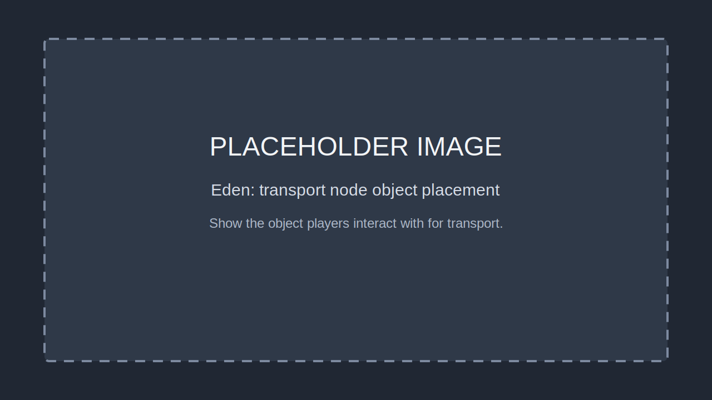
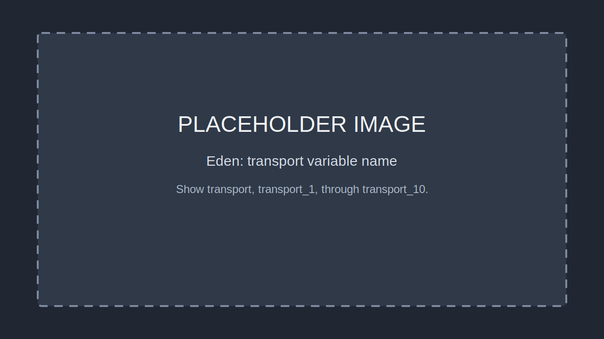
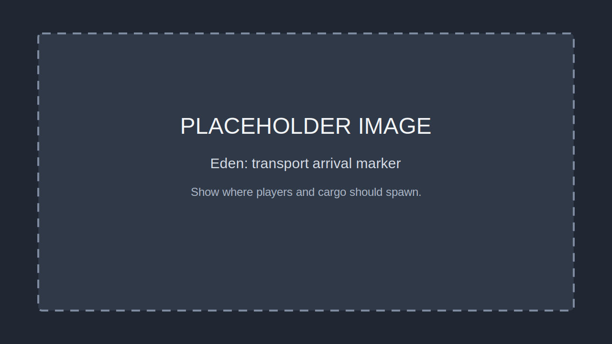
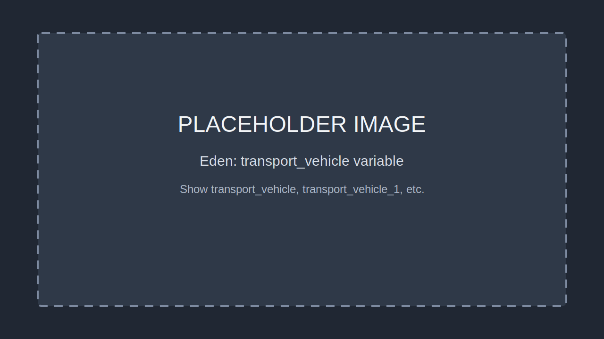

# Transport Service Guide

The transport service provides paid point-to-point travel for players and
nearby vehicles or passengers. It is framework-owned: missions only need placed
transport objects and optional arrival markers with the expected variable names.

## Mission Contract

By default the framework discovers transport nodes by exact mission namespace
variable name:

```text
transport
transport_1
transport_2
...
transport_10
```

Each node is an Eden-placed object players can stand near. When a player opens
the actor interaction menu within 5 meters of a node, the menu shows a
Transport action. Selecting Transport opens destination choices for the other
configured nodes.

Arrival markers use the same suffix:

```text
transport_arrival
transport_arrival_1
transport_arrival_2
...
transport_arrival_10
```

Object names used only to exclude parked ferry/transport vehicles from cargo
pickup scans use this convention:

```text
transport_vehicle
transport_vehicle_1
transport_vehicle_2
...
transport_vehicle_10
```

The suffix mapping is direct:

- `transport` arrives at `transport_arrival`
- `transport_1` arrives at `transport_arrival_1`
- `transport_10` arrives at `transport_arrival_10`

If an arrival marker is missing, the framework falls back to a position behind
the destination node object.

## Pricing and Payment

The default fare is:

```text
base fare + distance in kilometers * price per kilometer
```

Current defaults:

- base fare: `$100`
- price per kilometer: `$50`
- cargo scan radius: `25` meters
- max indexed nodes: `10`

Payment is server-authoritative. The transport service attempts payment in this
order:

1. Player bank balance.
2. Player cash.
3. Organization credit line fallback.

The player and cargo are moved only after payment succeeds.

## Cargo and Vehicle Transfer

When a player requests transport, the server scans near the origin node for
nearby vehicles, ships, aircraft, and player units. The scan ignores:

- the origin and destination transport nodes
- objects named with the `transport_vehicle` prefix
- the requesting player
- dead entities

Use `transport_vehicle*` names for the actual boat, ferry, aircraft, or set
dressing object that should not be moved as cargo.

## Optional Per-Node Overrides

The default naming convention should cover normal missions. If a specific
mission needs another prefix or different pricing, set variables on the
transport node object:

```sqf
this setVariable ["isTransport", true, true];
this setVariable ["transportLabel", "North Dock", true];
this setVariable ["transportNodePrefix", "dock", true];
this setVariable ["transportVehiclePrefix", "dock_vehicle", true];
this setVariable ["transportArrivalPrefix", "dock_arrival", true];
this setVariable ["transportMaxIndexedNodes", 4, true];
this setVariable ["transportBaseFare", 150, true];
this setVariable ["transportPricePerKm", 75, true];
this setVariable ["transportCargoRadius", 25, true];
this setVariable ["transportIncludeCargo", true, true];
```

Only use overrides when the default `transport*` convention is not appropriate.

## Image Checklist

Replace these placeholder image references after screenshots are captured:










## Mission-Side Code Requirement

No mission-side transport service, addAction script, or server event bridge is
required. The framework handles menu discovery, destination selection, pricing,
billing, cargo movement, and EventBus notifications.
